# 知识储备阶段

## 背景

目前已经对UE5 gameplay框架有了大致的认识与使用  对UE网络同步有初步的认识，跟着教程做了联机多人TPS游戏  对GAS框架有基础的认识。


基于此进行怪物猎人崛起的战斗系统复刻。  

预期架构为：

UI层 使用MVVM架构

3C：使用状态树控制，基于lyra运动系统   (我突然就知道了怎么用状态机来控制输入和动画蓝图了。因为这里和在连招里一样，可以天然的过滤掉不属于当前阶段的输入,比如说跳跃，当你在空中时，你不需要检测是否在空中，只要你状态树在空中状态没有跳跃响应，那么你怎么按都是没用的。然后状态。我感觉完全都可以交给状态树来设置，在character里只管收到按键输入tag然后根据该tag给状态数发事件就好。然后状态树更新在charatcer上的状态。这样也不用character自己判断到哪个状态了，状态就原生的和状态树状态保持一致.此时状态的改变通过函数或者说事件来传递给动画蓝图，动画蓝图也就正常的进行播放  听起来很完美啊。哦哦基础移动MVC已经处理了同步了。那么其实只需要注意其他的按键使用GA来触发就好了，自己写同步太麻烦了)

战斗系统：使用状态树控制连招阶段，并且配置数据驱动

属性与网络同步：大部分使用GAS覆盖

怪物AI：使用状态树+FSM  实现  部位伤害和肉质会使用物理资产来分区实现


部分架构可能随着学习的深入会有修改


## 目前已知缺乏的知识

1. MVVM使用

2. 状态树与LYRA运动系统
   
   
   
   

## MVVM笔记

### 准备工作

启用插件


### C++创建viewModel

继承UMVVMViewModelBase 类即可

依赖FieldNotify变量和函数将更改广播给绑定到它们的控件。


需要被绑定的变量会使用到如下描述符


这里需要说明的是

如果对set get时没有什么特别的逻辑需求。那么可以不指定函数名甚至不显式实现函数。UHT会自动的生成对应的模板函数。并且在蓝图中访问时会走该函数。

但是如果在C++中不经过get set直接修改函数，其是不能够做到广播效果的

如果需要有特殊的逻辑，那么可以自己实现get set然后将函数名setter="function_name"的形式加上。以及不要设置为UFUNCTION  普通的就好


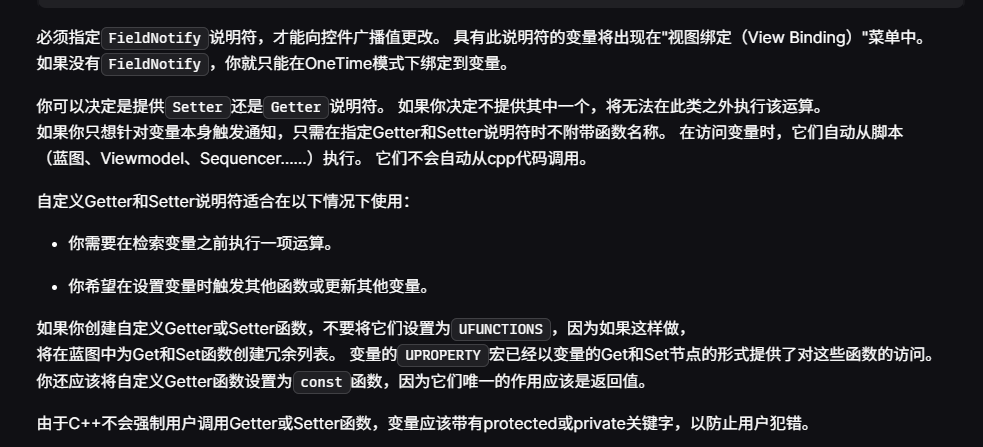


#### 带filedNotify说明符的函数

这个是为了做这种情形，比如说生命值百分比。但是我们不想做一个成员变量来给UI绑定。那么其实可以做一个对应的函数给组件绑定

但是这样的话就需要在比如说生命值的变化里主动调用这个函数。稍微有点麻烦，感觉不如加一个变量呢还是全自动的。但是变量也需要我手动算啊。反正有这么回事

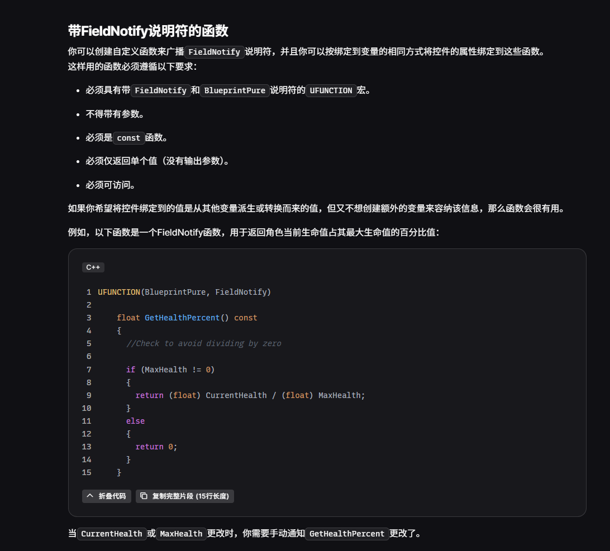

#### 使用UE提供的宏来方便的判断是否产生了变化以及广播变化

其实底层也是广播的委托

属性转发宏本质上就是判断了新值和旧值是否变化了，如果变化了则广播。然后如果广播则会返回true

那么会执行下面的广播事件，将函数指针传入，会有MVVM系统去调用该函数。然后通知所有绑定了该函数的组件取值


```
UCLASS(BlueprintType)
    class UVMCharacterHealth : public UMVVMViewModelBase
    {
    GENERATED_BODY()

    private:
    UPROPERTY(BlueprintReadWrite, FieldNotify, Setter, Getter, meta=(AllowPrivateAccess))
        int32 CurrentHealth;

        UPROPERTY(BlueprintReadWrite, FieldNotify, Setter, Getter, meta=(AllowPrivateAccess))
        int32 MaxHealth;

    public:
        void SetCurrentHealth(int32 NewCurrentHealth)
        {
            if (UE_MVVM_SET_PROPERTY_VALUE(CurrentHealth, NewCurrentHealth))
            {
                UE_MVVM_BROADCAST_FIELD_VALUE_CHANGED(GetHealthPercent);
            }
        }

        void SetMaxHealth(int32 NewMaxHealth)
        {
            if (UE_MVVM_SET_PROPERTY_VALUE(MaxHealth, NewMaxHealth))
            {
                UE_MVVM_BROADCAST_FIELD_VALUE_CHANGED(GetHealthPercent);
            }

        }

        int32 GetCurrentHealth() const
        {
            return CurrentHealth;
        }

        int32 GetMaxHealth() const
        {
            return MaxHealth;
        }

    public:

        UFUNCTION(BlueprintPure, FieldNotify)

        float GetHealthPercent() const
        {
            if (MaxHealth != 0)
            {
                return (float) CurrentHealth / (float) MaxHealth;
            }
            else
                return 0;
        }

    };
```

C++里对属性变化进行广播差不多就是这样了


### 如何在UI里绑定viewModel

以及一个UI可以绑定多个viewmodel来获取不同的数据

这里只是选定了UI需要哪个类。但是其实还没有绑定实例


绑定的时候可以该变量名


#### 添加实例的方式有多种

需要先在视图模型界面选中需要设置的viewmodel然后跳转到detail界面去设置实例化方式

下面会一一解析

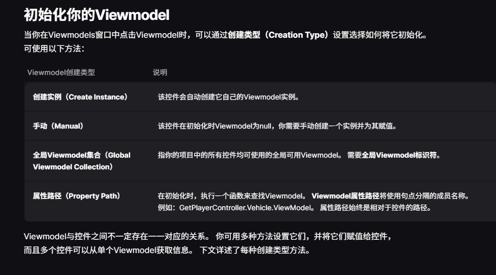


每个控件都会有自己的viewmodel实例。相互间不互通，不感知

**UE只会在ViewModel为空时创建新实例，ViewModel会在PreConstruct和Construct事件之间创建。**

所以如果是创建实例的方式，要用这个实例的话再构造函数之后进行获取

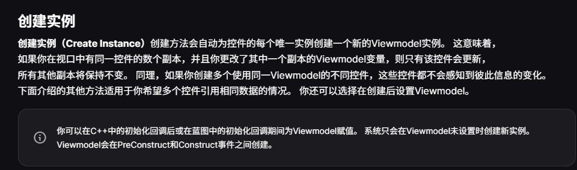


就是一开始为空，需要在程序的某个位置手动赋值

然后赋值节点为

C++应该也有一样的

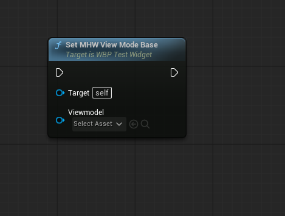


这个其实就是说相当于让其调用一个函数去获得videmodel  这种方式可能还挺好的。因为可以在基类中添加函数。这样所有的子类都可以填相同的，如果有需要的话重写就好了

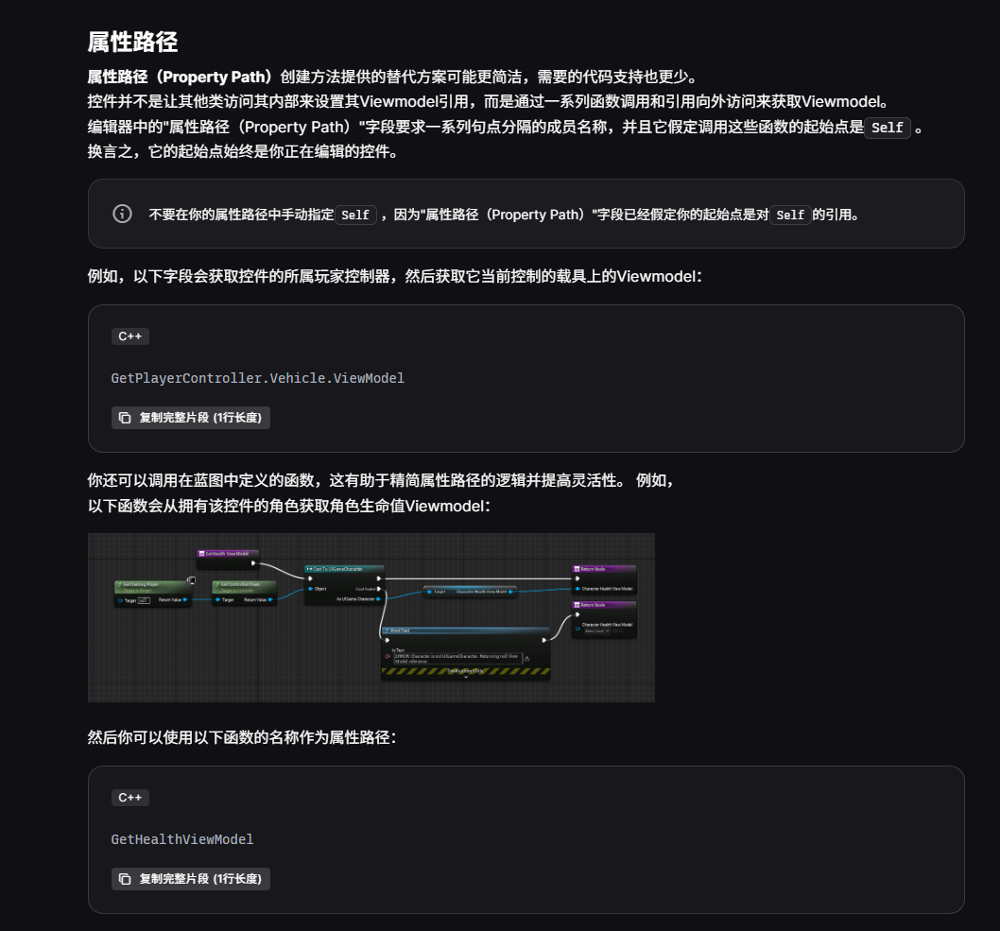


这个其实就是将viewModel放到了全局数组里


我看他们有人用法是 这里的identifier和contextname一致就可以找到

但是好像不是很好，毕竟官方说的是和类名一致 


```
所以同一个类的多个实例，推荐使用局部 Context：手动/创建实例 等方式

InventoryWidget → InventoryViewModel 实例 1
EquipmentWidget → InventoryViewModel 实例 2

而全局 Context 更适合：

GraphicsOptionsViewModel
AudioSettingsViewModel
PlayerProfileViewModel

这类整个游戏只需要一份的状态。
```

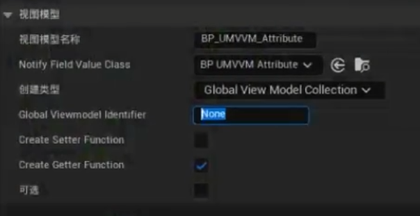


### 在配置好实例化后，可以在UI中以成员变量的方式访问viewModel  也不是实例化吧，就是加入了UI之后就可以访问了

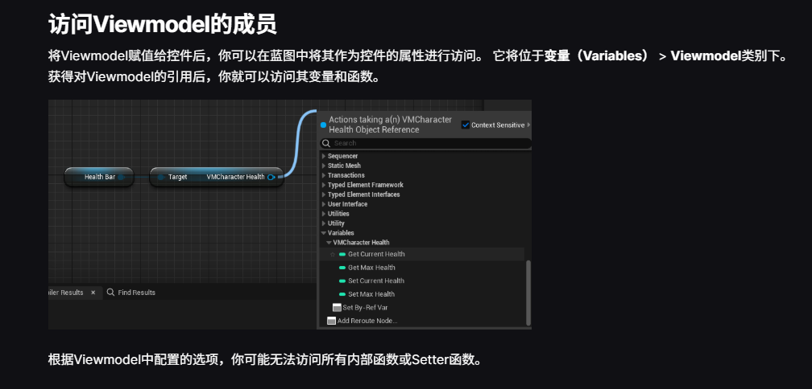


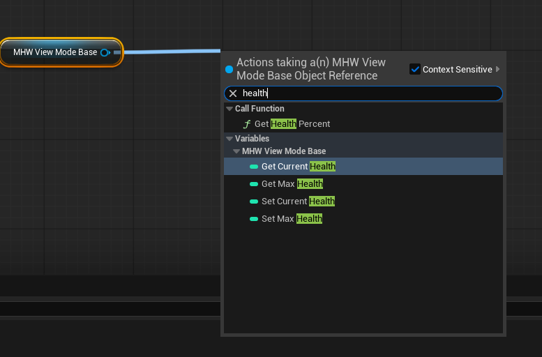


### viewModel添加数组变量?

他这里什么意思，没法通知数组变量吗  

喔喔，是说数组的增删没法主动检测到变化。这里就可以做函数来给他绑定

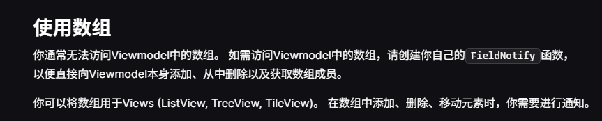


这里的第二种情况指的是  数组中的数据变化了。如果数组成员是viewmodel其就可以自己广播到需要他的组件上 而数组所在的viewmodel 看自己的需求是否广播

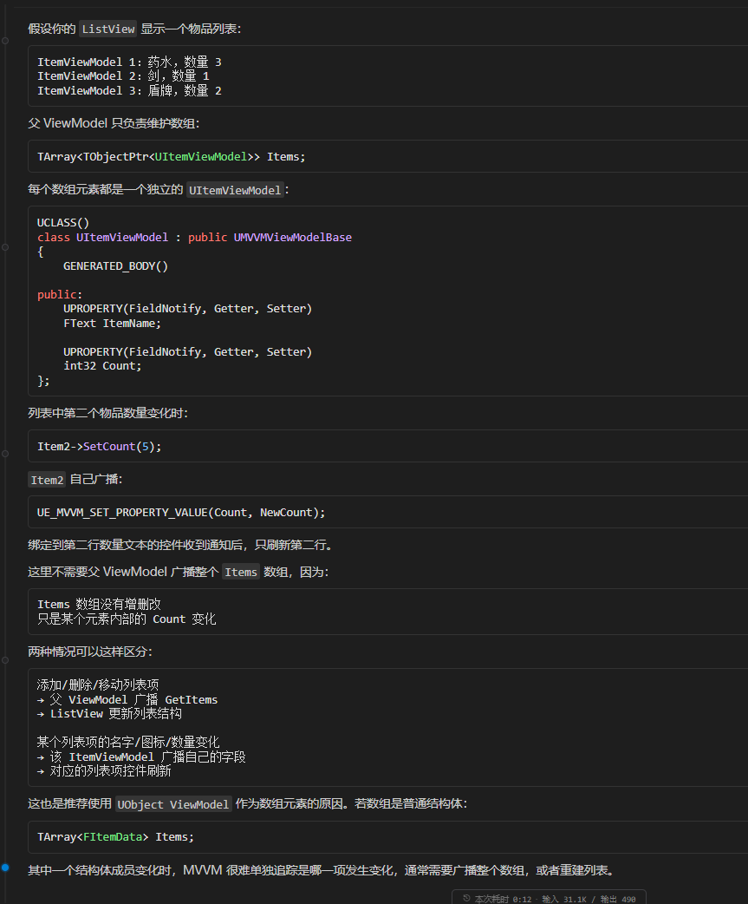

### 配置视图绑定

需要关一下旧版的绑定。说是因为旧版的绑定使用的是tick的形式，性能巨差，然后新版是用的蓝图可用多播委托。并且由于其绑定方式会和新版冲突，所以直接删掉就好


然后现在details里就只有  绑定到viewmodel了 

 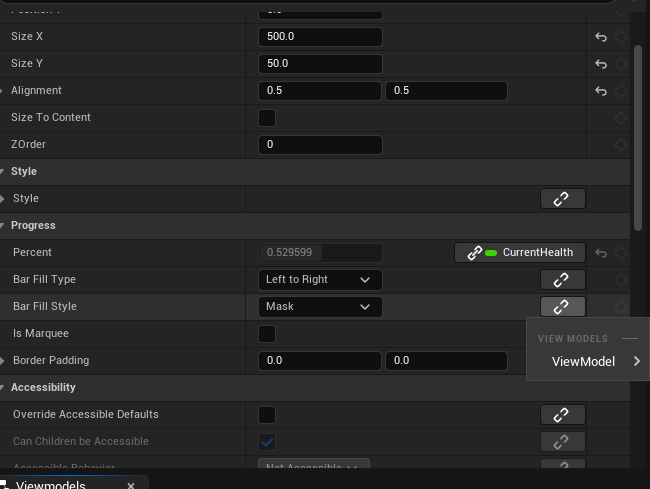


#### 再关闭一下viewmodel在详情面板中的绑定，让其只能在viewBanding界面绑定

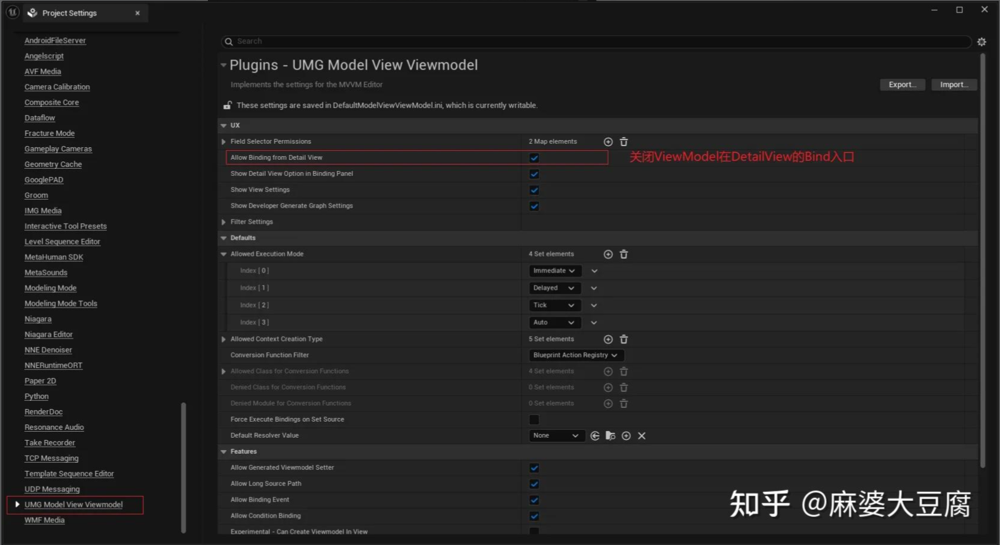


#### 接下来就可以在viewBanding界面进行绑定了

这里选择控件再选择对应的viewmodel数据，如果数据类型不一致还需要转换函数来转换一下

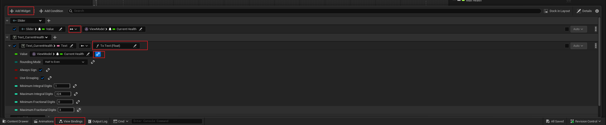

#### 如果没有合适的转换函数，比如说自定义类型 那么可以手动写转换函数


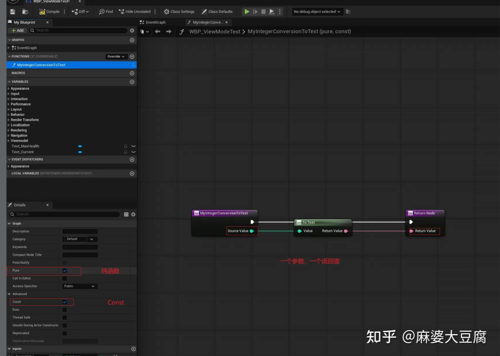


##### 如果要在C++中实现，需要放到蓝图可调用库里


```
在 C++ 中，全局可用的 MVVM 转换函数应放在继承自 UBlueprintFunctionLibrary 的函数库中，并满足：

static
UFUNCTION(BlueprintPure)
一个输入参数
一个返回值
不能是网络函数、事件、废弃函数或仅编辑器函数
例如，创建头文件：

// MHW_MVVMConversionLibrary.h
#pragma once

#include "CoreMinimal.h"
#include "Kismet/BlueprintFunctionLibrary.h"
#include "MHW_MVVMConversionLibrary.generated.h"

UCLASS()
class MHWR_REBUILD_API UMHW_MVVMConversionLibrary : public UBlueprintFunctionLibrary
{
    GENERATED_BODY()

public:
    UFUNCTION(BlueprintPure, Category="MVVM|Conversion")
    static float HealthToPercent(float Health);
};

实现：

// MHW_MVVMConversionLibrary.cpp
#include "MHW_MVVMConversionLibrary.h"

float UMHW_MVVMConversionLibrary::HealthToPercent(float Health)
{
    return FMath::Clamp(Health / 100.0f, 0.0f, 1.0f);
}

之后重新编译项目，在 View Binding 的转换函数列表中即可使用：

CurrentHealth
    ↓
HealthToPercent
    ↓
ProgressBar.Percent

如果转换需要多个数据，不能直接使用两个输入参数，因为 MVVM 转换函数要求一个输入参数。可以将多个值封装到结构体中：

USTRUCT(BlueprintType)
struct FHealthData
{
    GENERATED_BODY()

    UPROPERTY(BlueprintReadWrite)
    float Current = 0.0f;

    UPROPERTY(BlueprintReadWrite)
    float Max = 1.0f;
};

然后：

UFUNCTION(BlueprintPure, Category="MVVM|Conversion")
static float HealthDataToPercent(FHealthData Data);

此外，转换函数的输入和返回类型必须与绑定链路两端兼容。例如：

static FText IntToText(int32 Value);
static float IntToPercent(int32 Value);
static FLinearColor BoolToColor(bool bValue);

这里的“全局”是指该函数不依赖某个具体 UserWidget 实例，任何符合类型的 View Binding 都可以使用它。
```


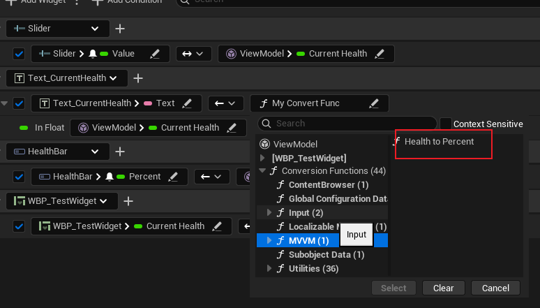


### 绑定对象不仅限于组件里的内容，自己的属性也是可以绑定的，只需要开启filedNotify就可以，包括C++继承来的属性也可以


#### 以及这样单纯的绑定，结果只是数据会变化。但是如果我需要数据变化时触发自己的逻辑应该怎么做?

其实逻辑就和viewmodel的getter 和 setter类似。他们都是在数据变化时发送广播然后对应的收到广播的去调用对应属性的setter。在setter这里就可以执行的自己的逻辑。比如说如果在viewmodel里health的setter里可能会判断数据是否改变，然后其需要继续更新生命比例的值


但是蓝图里的health的setter只需要更新当前生命值文本就好  


蓝图/C++中的setter实现方式

我提供了一个native的虚函数给蓝图。蓝图重写这个函数来做自己想要的逻辑


由此我们可以自定义结构体类型，想传啥传啥


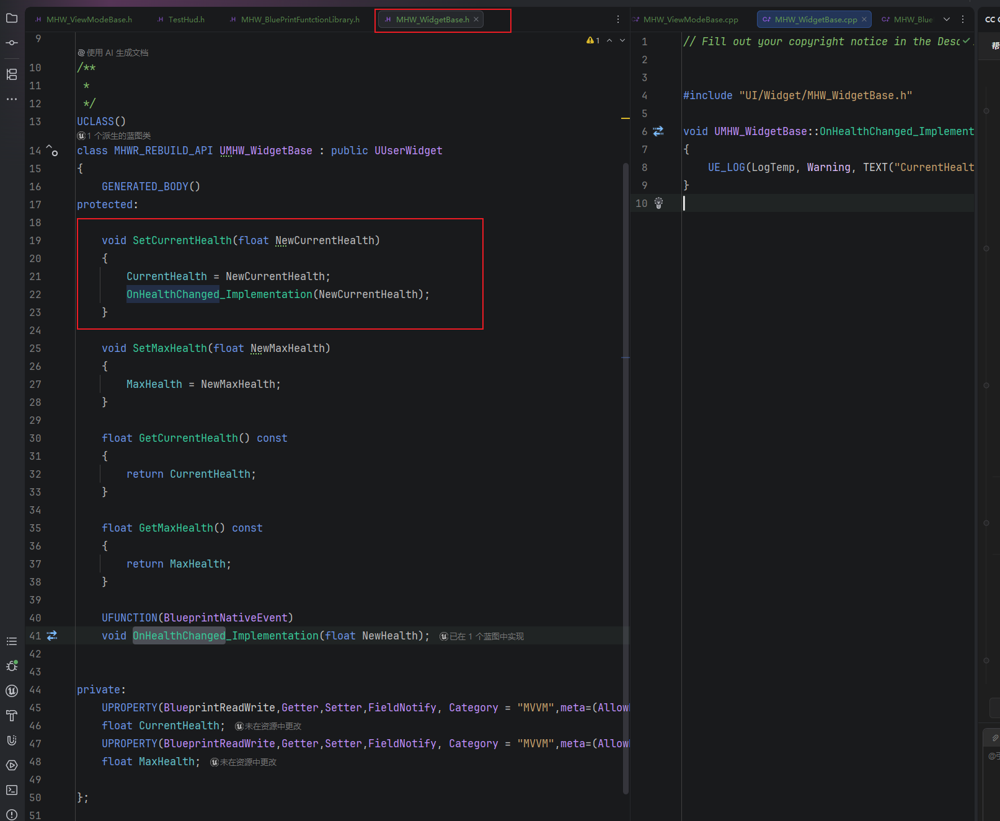

效果就是在属性值变化的时候打印了新值


#### view的某个值在UI层修改了需要传递给绑定的viewmodel

那么可以手动调用广播

这是因为广播函数是在 接口中定义的 然后uuserwidget 继承了这个接口  这样才能做到数据发给viewmodel

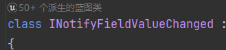


**这里作为源头就需要做相等判断了，不然会无限循环的**

```
void SetMaxHealth(float NewMaxHealth)

{    
                if(MaxHealth != NewMaxHealth)
                {
                MaxHealth = NewMaxHealth;
        UE_MVVM_BROADCAST_FIELD_VALUE_CHANGED(MaxHealth);
                }

    }
```


### VIEW 和 viewmodel层双向绑定大概就是这样。但是viewmodel 是如何和model绑定起来的

AI如是说   让自己获取model对象 其和model之间是单项依赖的 viewmodel依赖于model 以委托获取传来的数据，以函数传递数据

```
UE5 的 MVVM 系统主要负责 View ↔ ViewModel，不会自动管理 Model ↔ ViewModel。Model 和 ViewModel 的同步通常由你自己通过委托、事件或接口实现。

推荐的数据流是：

Model 发生变化
    ↓
Model 广播委托
    ↓
ViewModel 更新自己的 FieldNotify 属性
    ↓
View 自动刷新

View 的输入
    ↓
ViewModel Setter/命令
    ↓
ViewModel 调用 Model 接口修改数据
    ↓
Model 广播变化

例如 Model：

DECLARE_MULTICAST_DELEGATE_OneParam(FOnHealthChanged, float);

class UHealthComponent : public UActorComponent
{
public:
    FOnHealthChanged OnHealthChanged;

    float GetHealth() const
    {
        return CurrentHealth;
    }

    void SetHealth(float NewHealth)
    {
        if (CurrentHealth == NewHealth)
        {
            return;
        }

        CurrentHealth = NewHealth;
        OnHealthChanged.Broadcast(CurrentHealth);
    }

private:
    float CurrentHealth = 100.0f;
};

ViewModel 持有 Model 引用，并监听它：

UCLASS()
class UMHW_HealthViewModel : public UMVVMViewModelBase
{
    GENERATED_BODY()

public:
    void Initialize(UHealthComponent* InHealthComponent)
    {
        HealthComponent = InHealthComponent;

        if (HealthComponent)
        {
            HealthComponent->OnHealthChanged.AddUObject(
                this,
                &ThisClass::HandleHealthChanged);

            HandleHealthChanged(HealthComponent->GetHealth());
        }
    }

    void SetHealth(float NewHealth)
    {
        if (HealthComponent)
        {
            HealthComponent->SetHealth(NewHealth);
        }
    }

private:
    void HandleHealthChanged(float NewHealth)
    {
        UE_MVVM_SET_PROPERTY_VALUE(CurrentHealth, NewHealth);
    }

    UPROPERTY(FieldNotify, Getter, Setter)
    float CurrentHealth = 0.0f;

    TObjectPtr<UHealthComponent> HealthComponent;
};

实际含义是：

Model → ViewModel：通过委托通知
ViewModel → Model：通过函数调用或接口修改
ViewModel → View：通过 FieldNotify 通知

注意不要让 ViewModel 直接持有 Widget 引用，但 ViewModel 持有 Model 引用是正常的，因为 ViewModel 本质上就是 Model 面向 UI 的适配层。

还需要在 ViewModel 销毁或切换 Model 时解绑委托，避免回调访问失效对象。对于 Actor、Component 等 UE 对象，推荐使用 TObjectPtr、TWeakObjectPtr 和 AddUObject/RemoveAll 管理生命周期。
```

## 游戏存档笔记

### 需要继承这个saveGame类 这个类里就需要存放我们需要保存的信息


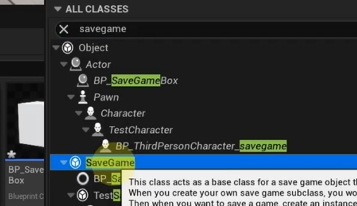

保存就是往调用这个节点。不清楚slot是什么意思


加载不需要指定存档对象吗

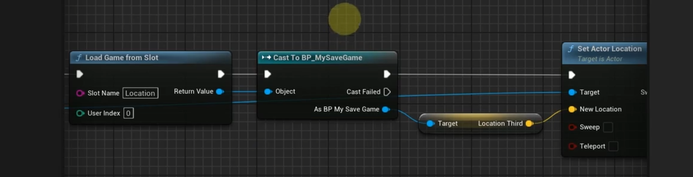


游戏开始时读取保存数据


实际上存放数据是在这里。然后文件的名字就是slotName  。那我大概知道了  他是吧一整个对象保存为了slotName的文件，之后读取也是一样的，读取改文件来创建对象。可以从该对象中获取内容


### C++的话也是差不多的

有这几个变量去掉函数就好

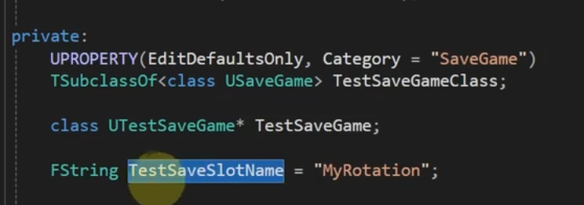

然后所谓的玩家，其实就是允许为每个玩家存储一份数据

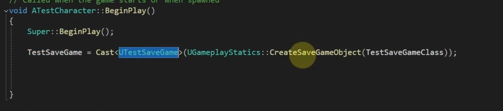

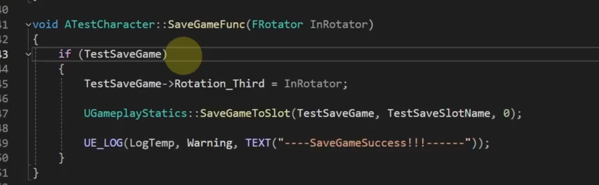


### 注意事项

异步保存 用于保存比较大的数据 一帧保存不完的  不能在函数里用，只能在事件图标里用

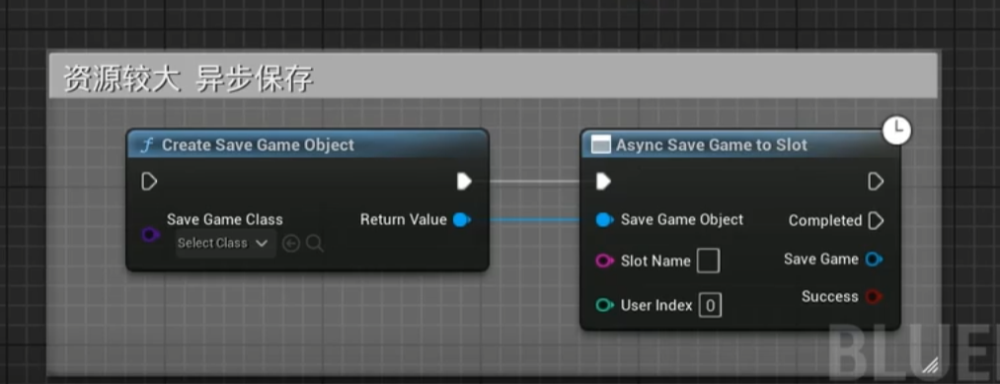

异步加载 同理


## 状态树

### 启用插件

两个都要


### 新建

上面是默认的，下面的是C++可派生的

上面的区别是，一个不需要AI controller就可以运行 适合于player用

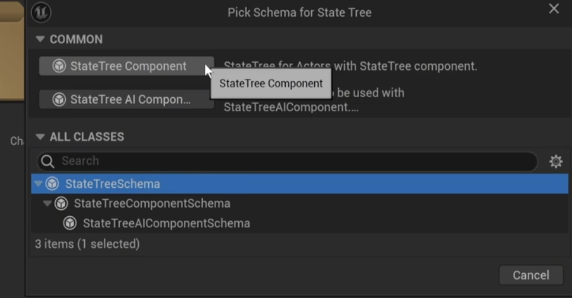

### 一些界面展示

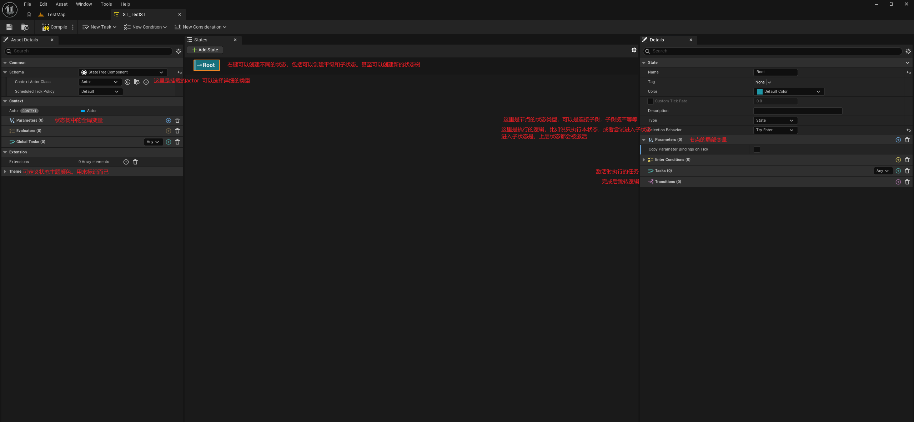

### 如何给actor挂载状态树

根据是否是aicontroller添加对应的状态树组件

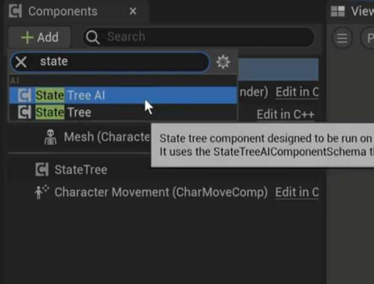

这里还可以改全局变量

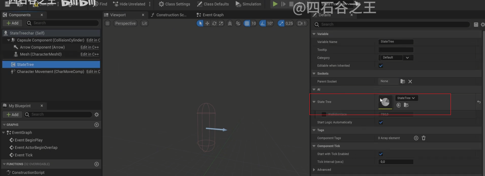

### 创建自定义tasks

他为什么执着于将st挂载到actor上呢，他的意思是，他希望这个状态树是基于角色而不是控制器的

目标。复刻ai架构自带的moveto 其实就是行为树自带的哪个task的封装

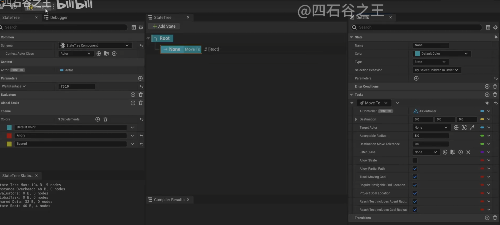

将其拆分为了寻找目标点和移动两个任务，顺便演示一下如何共享数据

任务基类如下

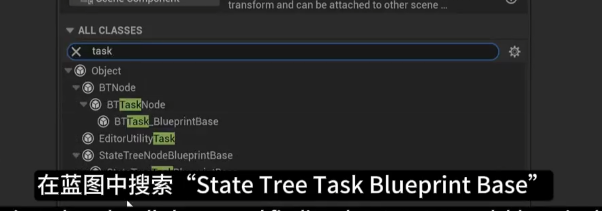

几个可以重写的核心函数


他这里实现moveto是访问了actor上的ai控制器，如果用于player就无所谓


注意一个状态可能会有多个task在同时执行，一旦一个调用结束并且失败。那么会结束所有的任务

所以同一状态的多个任务最好只有一个任务有正确的结束位置，比如说寻找目标位置需要输出点，如果正确输出了点，但是其不能结束任务，需要交给移动来结束任务

以及这个结束其实会结束整个正在激活的状态。比如说如果子状态激活了，父状态也有任务在跑并且提前结束了。那么整个树都会结束，进入到过度

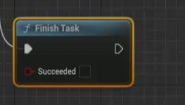


添加任务时就可以配置参数了

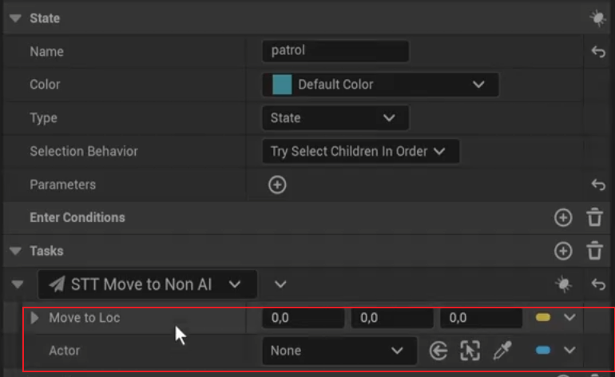

这个是寻找位置逻辑

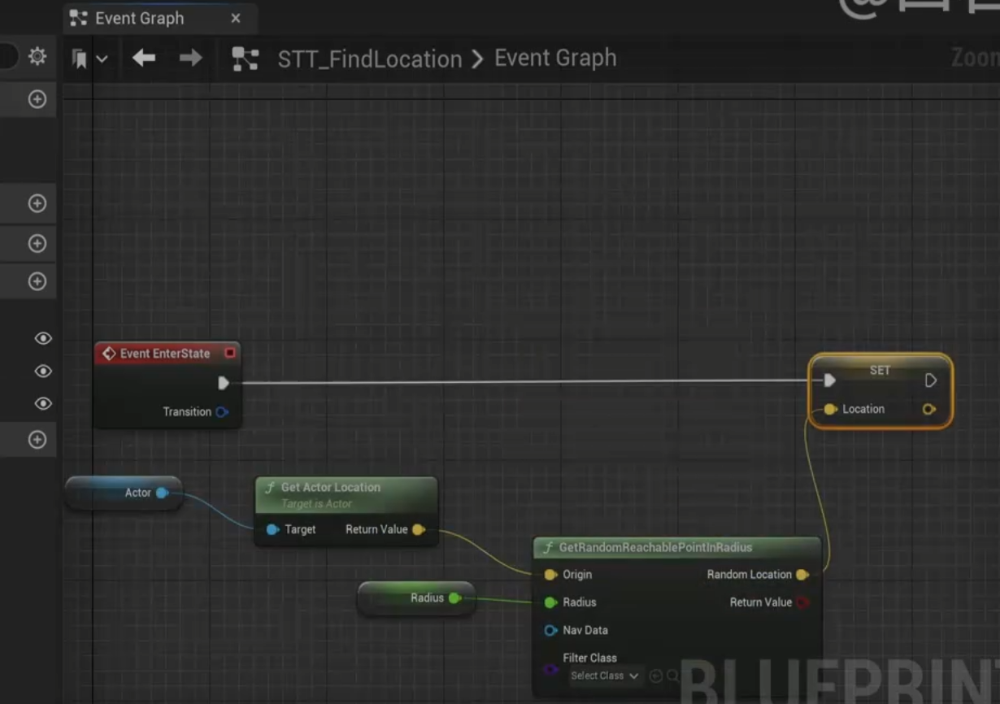

这里可以通过这个下拉框绑定蓝图中有的参数包括传入的

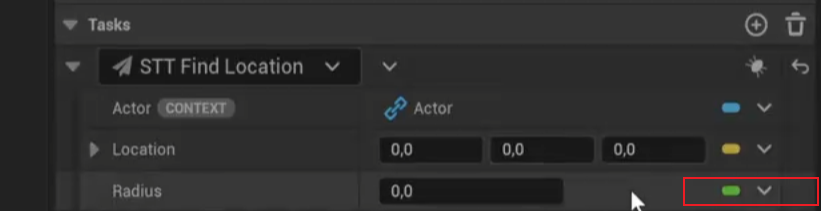


记得将寻点任务放到寻路位置上方。然后为目标点绑定变量。变量可以绑定到当前状态的其他任务和父任务的输出值


### 使用category来隐藏输出属性或者绑定context

比如说传入的actor如果在task内需要，只需要在task里将该局部变量分到context组就可以自动绑定，不区分大小写

然后如果一个值是输出那么设置为output，其就不能被手动填值


设置为input的话，会强制要求绑定，同样不会让你手动输入 

### 设置transition过度

因为状态树逻辑就和行为树差不多，其会每次执行可以执行的状态，然后返回root继续重复。如果想要跳转到其他状态则需要 设置过度相关内容

之类的触发条件分别是，完成，成功，失败，每帧检查跳转条件 事件触发等

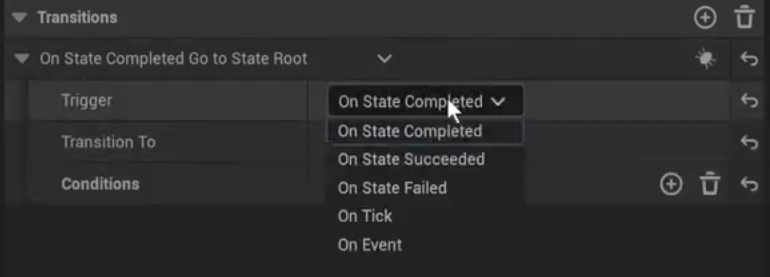

事件触发甚至直接是gameplay event


然后过度目标可以设置不跳转，下一个同级状态(可能会因为进入条件导致进入失败)，下一个可选状态(会一个个尝试能否进入同级状态)，直接将树设置为失败，直接设置为成功 后两者在使用子树时很实用

或者直接指定对应的跳转状态


而当尝试进入的节点有进入条件，导致进入失败时。状态树会回到root重新开始

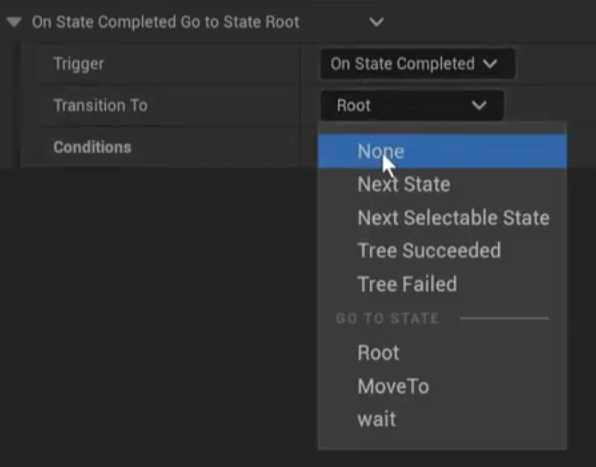

#### 过度条件  不是进入条件


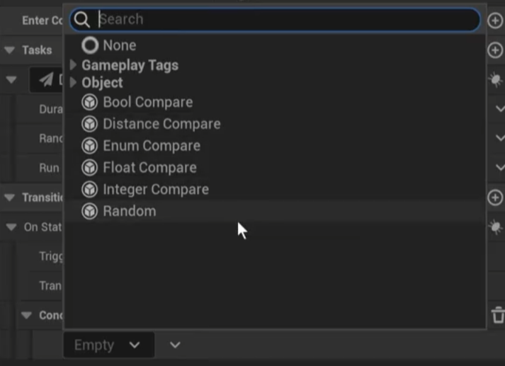

可以添加多个逻辑，其间的与或非可以自己设置


#### 创建自定义过度条件

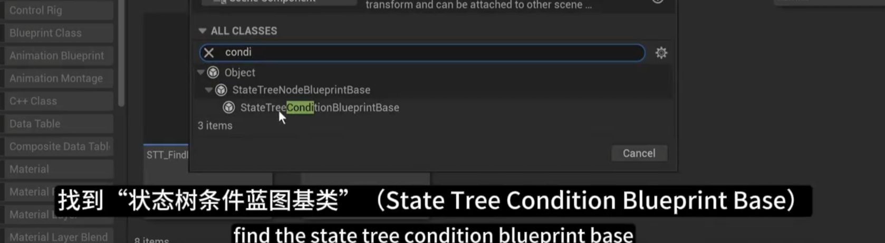

只有一个可重写函数  然后返回对应的bool,就好

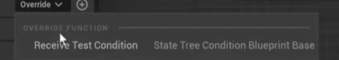

他这里还传了比较方式


过度会按照顺序执行，上一个执行失败了会依次执行后续的跳转   甚至可以做成ontick然后设置该检测条件

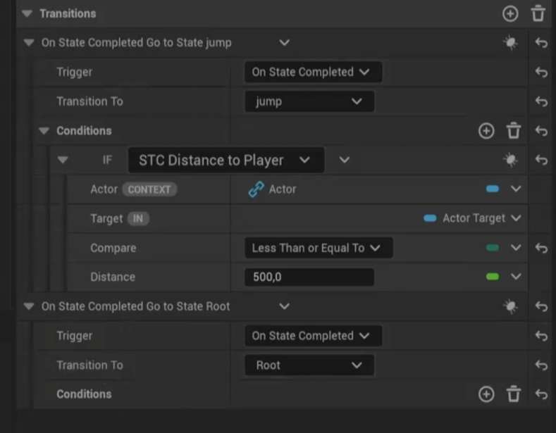

#### 进入条件和跳转条件的逻辑类似，不过是在进入状态时评估然后按照预设逻辑，比如说找下一个还是直接回到ROOT来继续执行

类都是和跳转条件一致的，函数没有输入参数，对应所需的参数需要以成员变量的方式暴露和使用


### 评估器与全局任务

全局任务就是每tick更新的东西，比如说多个state都需要用到的内容。与玩家的距离值什么的。他会作用于整个树

全局任务类和普通任务类没区别，只是运行在不同的地方

#### 评估器 说是全局任务的优化版本，基类不一样了   所以对于全局需要执行的操作直接使用评估器，还可以和task分开。可能评估器内部实现更针对于全局优化吧


三个可重写函数


他这里用来获取了开始的初始位置，保证了AI巡逻时跟着玩家跑远了也能回到初始地区

### 添加冷却时间   实现方法多种可以参考他的   因为UE没有带原生冷却

### 效用选择行为   按找效用加权随机选择

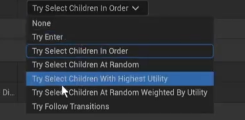

选择之后，其子状态就会出现效用值可配置，但是问题是  这个是权重，其本身的分数默认是0 ，所以只设置权重是没有用的。大家算出来都是0他就会像以此选择子项一样执行


在加号上可以添加不同基准值

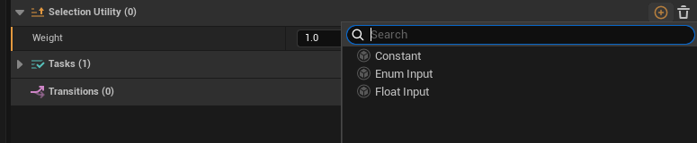

选择float输入时可以设置输入clamp以及对应的值映射 比如说 0-3000 映射到 0-1  

也可以添加自定义的曲线来做这个


也可以使用自定义枚举并且定义每个枚举值的基础值  这样可以做到根据AI所处的状态不同有不同的分数


### link assset与模块化开发  就是之前说的子树的部分

虽然能让主树简单可读，但是缺点就是没法再准确的跳转到某个链接资源里的具体状态了，只能到大模块


在子状态树种完成模块化任务后应该编辑子树为成功或者失败，结束这一整个子树


### 事件触发

即游戏gameplay event 和tick类似，之前tick是每帧检测，这个event就是在这个state在激活中时，如果收到事件就会执行跳转

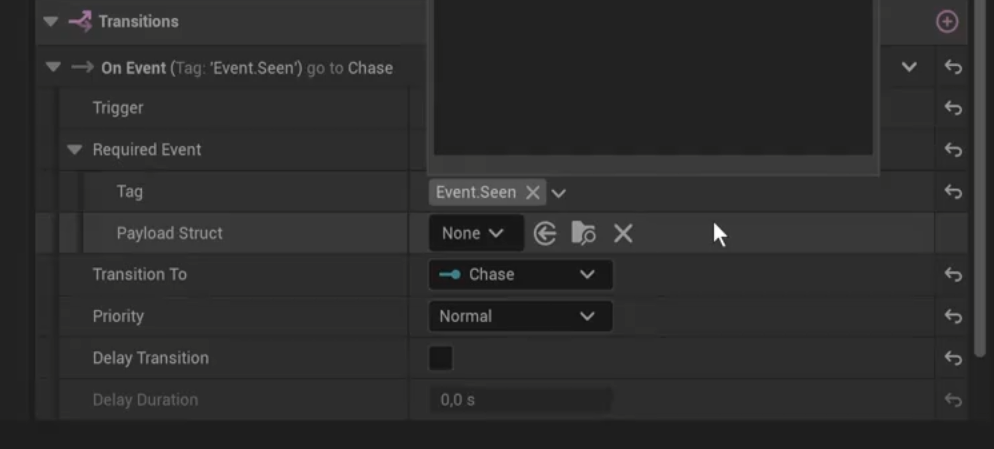

payload里可以带很多种类数据


还可以设置优先级，在同一时刻收到多个事件那么优先级高的会执行

以及设置延迟之类的


可以通过给AI配置感知来发送gameplayEvent  当然你用其他方式发送也可以，那玩意是个蓝图可调用库

## 使用GAS制作连招系统

他这个调试插件真不错啊

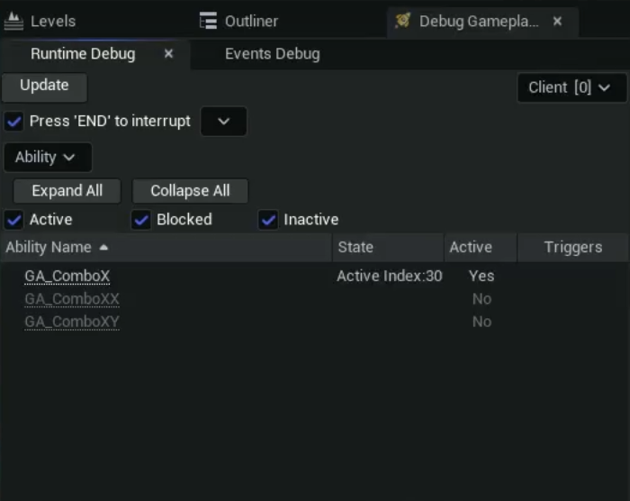

### loose gameplaytag  当然还有remove  以及replicate版本


```
GAS 中的 Loose Gameplay Tags 是直接添加到 AbilitySystemComponent 上的标签，不依赖 GameplayEffect。

常见操作：

AbilitySystemComponent->AddLooseGameplayTag(Tag);
AbilitySystemComponent->RemoveLooseGameplayTag(Tag);

“Get Loose Gameplay Tags” 的意思是：

获取当前直接挂在 AbilitySystemComponent 上的 Loose Tag 集合。

例如：

添加 State.UI.InventoryOpen
添加 State.Player.TargetLocked

之后调用 GetLooseGameplayTags，可以得到这些标签。

它和普通 Gameplay Tag 的区别：

GameplayEffect 授予的 Tag
    → 随 GameplayEffect 生命周期自动添加/移除

Loose Gameplay Tag
    → 由代码手动添加/移除

例如：

// 添加
ASC->AddLooseGameplayTag(FGameplayTag::RequestGameplayTag("State.UI.MenuOpen"));

// 查询
if (ASC->HasMatchingGameplayTag(MenuOpenTag))
{
    // 菜单已打开
}

// 移除
ASC->RemoveLooseGameplayTag(MenuOpenTag);

需要注意：

Loose Tag 通常不会自动复制到网络另一端；
需要网络同步时，应使用对应的 replicated loose tag API，或使用 GameplayEffect 授予 Tag；
添加 Loose Tag 后必须正确移除，否则会一直存在；
同一个标签可能有计数，移除次数应与添加次数匹配；
战斗状态如眩晕、无敌、沉默等，通常更推荐用 GameplayEffect 授予 Tag，以便管理持续时间、来源和网络同步；
UI 状态、临时本地标记等场景适合 Loose Tag。
另外，如果你的目的是判断 ASC 当前拥有的所有标签，不一定要调用 GetLooseGameplayTags。通常使用：

ASC->HasMatchingGameplayTag(Tag)

因为它可以查询 ASC 当前拥有的匹配标签，而不仅仅是 Loose Tag。
```

### 如何取消前面的连段技能

他是直接使用canceltag来取消前面的。虽然我觉得直接动画蒙太奇被打断了就结束能力就好  说是和后续技能有冲突。

当然使用canceltag也可以

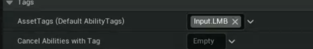

第二招大概是这样一个连段关系  而且还得额外加上阻止第一段触发。或者第一段需要加一个空闲tag才行

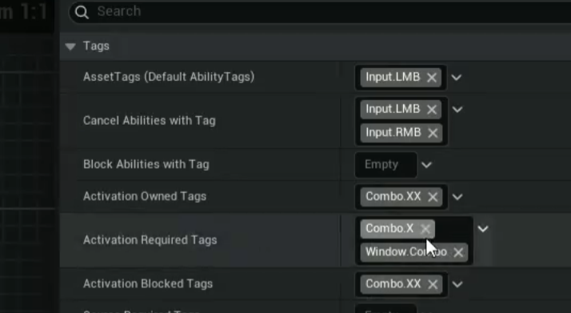

我感觉这个确实得用状态树来做。不然后续一多就完蛋。比如说怪猎一堆连招


### 预输入缓存  即玩家的派生下一招的窗口其实比较短，为了提升玩家体验，可以在窗口之前就对输入进行缓存

本质上是说需要将玩家的最后一次按键连招缓存

然后这里使用到了abilityTriger的方式 这个激活方式本质上就是ga在等待一个固定tag的gameplayEvent 我们需要激活的时候往ASC发事件就好


然后他又搞了个动画通知时间段。在这个时间段内的输入都会覆盖缓存的inputtag 当然实际项目中这里的inputtag会按照按下按键绑定的tag来缓存。然后在预输入窗口结束时/窗口开始时清空预输入

然后我会把预输入的尾巴放到连段窗口开始的后面。这样其实玩家在真正可以连段前都可以修正自己的输入


然后我可能会在窗口开始时去查看是否有缓存的输入，如果有就发送event如果没有就默默等待窗口期看有没有输入进来


但是这里就会出现的问题是，窗口标签没有在结束的时候被清除掉。导致在进入第二段之后可以直接派生第三段，因为满足有第二段标签和窗口。所以还是一样，动画开始时记得清楚一下标签


### 连段保留

主要是预输入优先级的问题，比如说喝药，闪避这类的优先级就可以比攻击更高

实现的话可以在捕获到该输入后直接关闭预输入窗口


然后连段保留指的就是在闪避后能够继续出连段，而不是回到第一招

之前说不能用被打断来清除tag就是因为这个啊

所以说闪避的话，就是不cancel能力就好了，但是要删掉连段窗口。之前的蒙太奇没有播完那个能力其实一直在那里的。然后闪避做完之后把窗口期一开就可以继续连段了。后续的攻击会负责cancel掉闪避前的连段


### 蓄力

这里就要用到增强输入的一些东西了

之前只用过modifier来做基础移动。这里用到了trigger

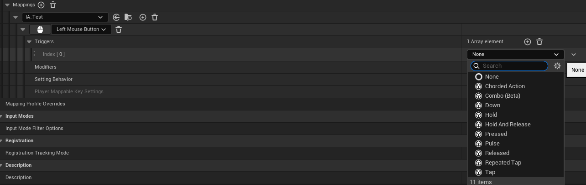

在这里配置的长按阈值值需要和蓄力开始动画的起始帧一致。比如说按下时是在正常的播放非蓄力连段。但是如果你长按了阈值事件那么播放蓄力能力就刚好是那个位置，不会跳变。以及这样完美切合就需要注意一下蒙太奇的混入混出问题

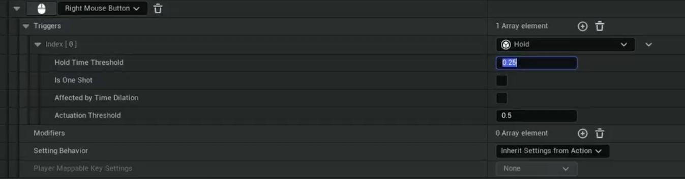


增强输入触发节点的讲解。

started只会在按下的瞬间触发一次

ongoing 是设置了长安触发器，但是没有到阈值会阈值ongoing

triggered正常来说会在按下时一直触发。但是这里是可以配置的。比如说有长按触发器，那么在按够之后才会trigger 并且之后是否会每帧trigger也是受配置的

canceled 如果长按但是没按够取消了那就会走这个

compeleted 长按满足阈值松开会触发

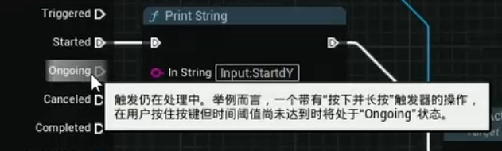


### 精防

思路

可以是在GA里调用wait event然后正常播放动画(或者直接精防或者闪避的ga有这个tag的trigger直接激活也可以)，然后给自己加一个精防窗口tag 被敌人攻击时如果对方检测到有这个tag 那么就给玩家发事件并且也不造成伤害。

到某一个地方就取消tag。事件在结束能力的时候也一起关掉这样。反正也没tag了不会被触发


#### 弹反

也是一样的，攻击方如果检测到受击者有精防tag那么就给自己触发弹反ga


### 伤害检测

他的思路是记录武器的socket的位移点。在上一帧和下一帧之间的位置之间进行linetrace然后返回受击对象。。

加socket好麻烦啊，每个武器都要加。那还不如做一个基类actor，确认好武器伤害箱之后，使用animState来开启和关闭伤害判定呢。然后把伤害过了的放到ignore里


### 使用ST制作连招系统

原因就是使用gas标签会需要各种cancel标签。而使用状态树，你不在该状态中是触发不了该能力，甚至说播放动画的

比如说初始状态是root那么你一旦在连招中，只要不是在前置state那么都无法再次触发自身

然后每一个input确认节点使用sendStateTreeevent来试图进行transition当然如果不在连招窗口那么是不会跳转成功的

character类可以保存变量来存是否是可预输入，可连段。 就不像之前是依赖于tag进行判断


我比较好奇这个怎么使用DA来数据驱动

不知道他这里跳转的时候判断预输入干嘛。这里应该只用判断是否可连段把


但是主要就是利用了状态树的状态。让一些之前block和cancel的东西不用做了，一旦进了一个状态就只有等这个状态该干的事情干完

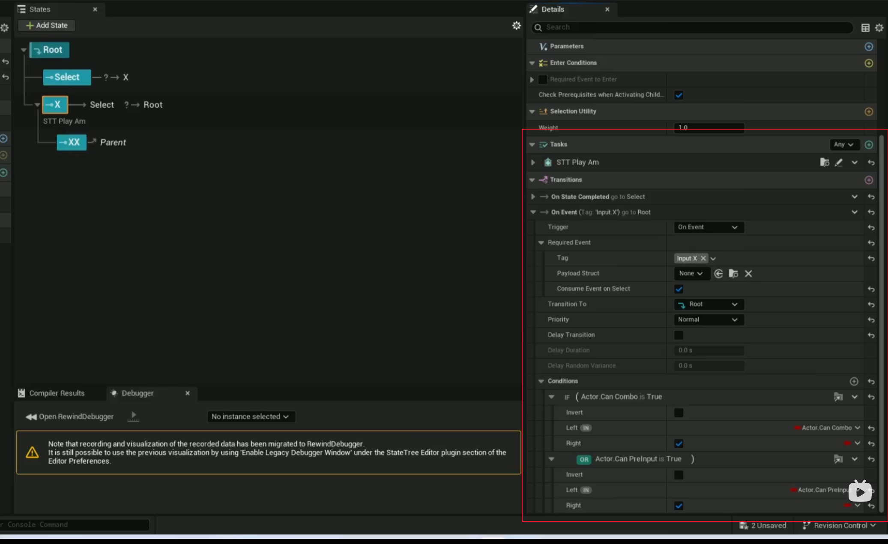


这个DEBUG器也挺好用的 rewind 去找下

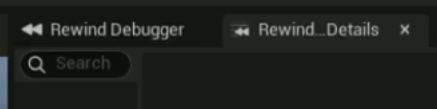

## 运动匹配笔记

EMM，先看lyra吧

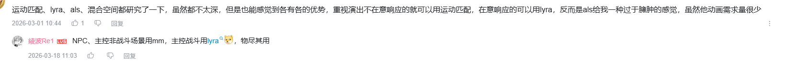

需要开启插件

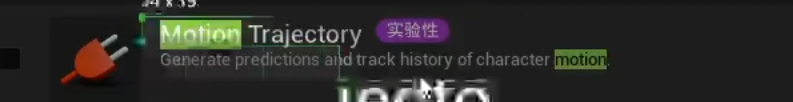


## 组合键连招

我看是使用了增强输入的弦操作修改器

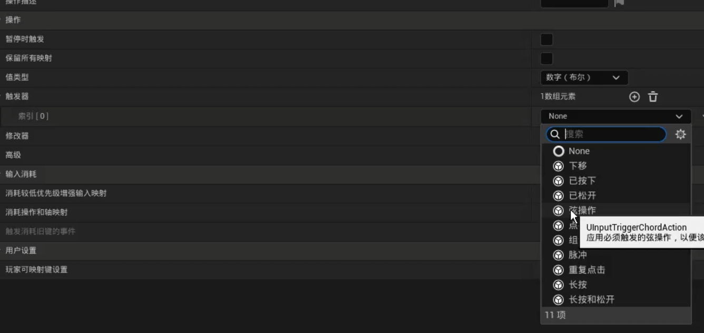

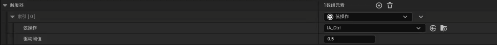

然后不管是哪一个先触发都是可以出发的。比如说先按左键再按ctrl ctrl按下的时候左键的对应能力也会触发，当然他这里是trigger

默认情况下组合键的优先级高于单按键。即即使有另一个IA绑定了左键，但是连招触发时也只会触发连招键。。 OK，那么问题是连招键。我应该怎么做输入缓存呢。

我想到的是，保存对应的输入触发结果，比如说eventTag 然后缓存下来方向。到时候发给st就好


然后是单纯两个按键的冲突，比如两个IA都是左键，我是觉得这种，在状态树里都可以很简单的解决。你只要不在同一个state里有两个相同按键的跳转就好

但是看看他是怎么解决的

做法是切换了新的输入映射上下文  这里是通过按键来添加和移除一个优先级更高的imc

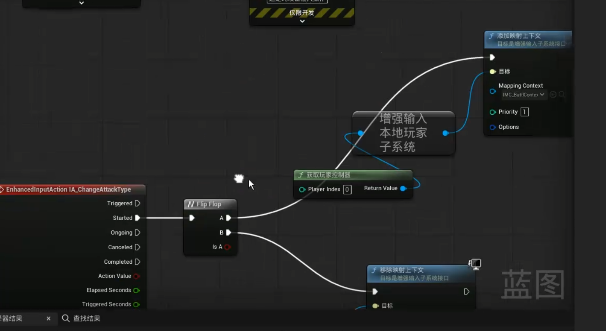

## 手柄输入

还有个手柄震动。

[【教程】如何在虚幻中给手柄添加震动反馈？_哔哩哔哩_bilibili](https://www.bilibili.com/video/BV1Ci421S7PB/?vd_source=39ee10d0477672d37574ff253a917df3)

手柄好像是有死区设置一说，因为手柄的输入是连续的，没有完全复位 01 所以得设置一下一些很小的值不触发输入

好像，，直接匹配改映射就好了

[【虚幻5知识分享】16_如何让键盘手柄同时操作以及识别最近操作的设备_哔哩哔哩_bilibili](https://www.bilibili.com/video/BV1XSiFB1E5j/?vd_source=39ee10d0477672d37574ff253a917df3)


可以从输入子系统直接拿到最近输入的设备  可以拿到对应的信息，然后就可以做相关的操作了

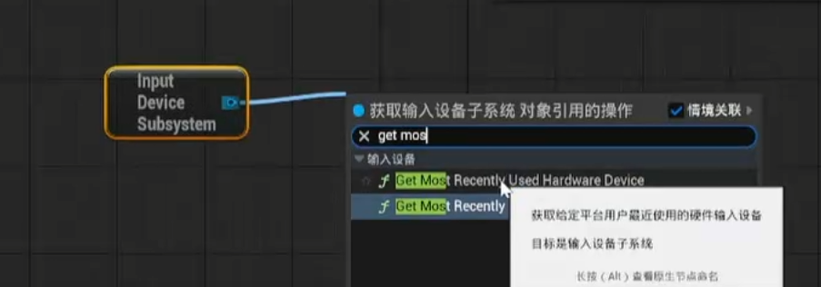

## 游戏资源解包

[(6 条消息) RE引擎资产解包 - 知乎](https://zhuanlan.zhihu.com/p/685480151)


这一部分饶了挺大的弯路。如果是用于游戏开发的。最终找到了一个很新很好的工具。特别方便，就是有时候导出的动画方向不太对，导入的时候手动转换一下就好了

[PieceMetal/ReExtractor: 面向 RE Engine 的 PAK 解包、模型/动画/贴图预览与 UE FBX 导出工具](https://github.com/PieceMetal/ReExtractor)

[【工具推荐】ReExtractor解包工具（解包街霸6、怪物猎人、生化危机导出FBX）_哔哩哔哩_bilibili](https://www.bilibili.com/video/BV1tHbD6wEPt/?spm_id_from=333.1007.top_right_bar_window_custom_collection.content.click&vd_source=39ee10d0477672d37574ff253a917df3)


这部分解出来的资源会上传到git一起，当然只是用到的资源。这里只有动画/模型/贴图  后续音效啥的可能还得找找


这里遇到了播放动画是浮空的问题，其实之前导入的时候就发现了

其主要原因就是，这里面导出的模型是腰骨骼在世界原点。但是骨骼动画是root在世界原点，所以在模型上应用骨骼动画时会被抬升。解决方法就是在blender里面把角色模型调整到腿在世界原点  本来说用blender试着改下。结果依托啊，blender的fbx导入，安装了better fbx也不中。我换maya试试

我不中了。搞了一下午。这玩意果然还是得美工来做。我暂时就直接把mesh往下移到合适位置吧。不行再说

好吧，逃不掉。在测试Z轴方向的跟运动时，会出现胶囊体和mesh分离的情况..

我看下咋搞吧


首先是
1.将从解包工具中导出的模型添加到blender，导入使用默认的导入工具就好。导入配置如下

主要就是忽略叶骨

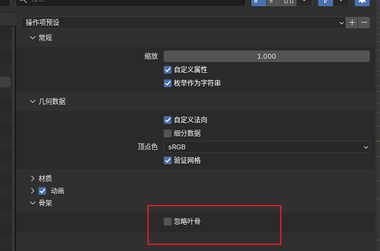

2.直接将角色的模型Z轴向上移动XX单位，这个根据模型身高。注意这里不是逻辑上的Z轴，而是实际上blender的Z轴。我真的服了。一堆软件度量衡都平不好。Z不标识向上的都来了，比如说从解包软件里获取的模型就是y轴向上

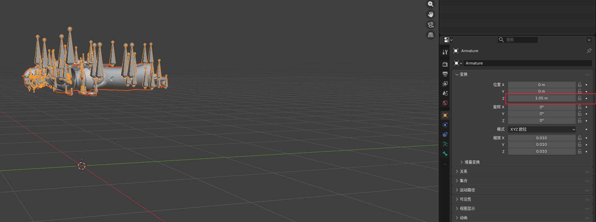

3.直接全选导出。导出设置如下。

实测之类的变换设置为Z向上，x向前也可以正常导入模型使用。好迷惑啊...不管了。这些不是我需要特别在意的

骨骼模型修正好之后，之前的动画就都可以用了

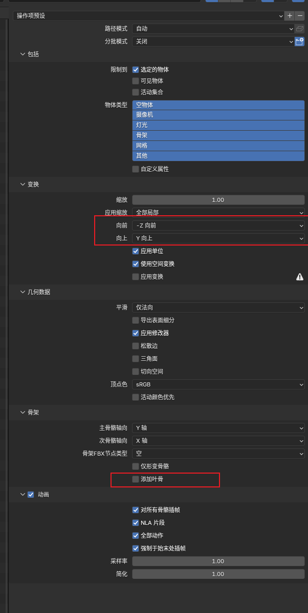


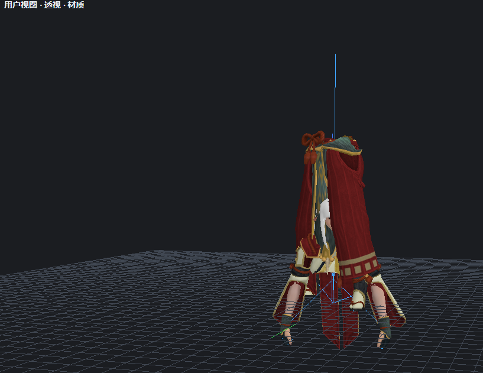


### 在做根运动是又发现了问题。因为根骨在腰那里 所以锁定根骨的时候整个角色会上移。

解决方法为，直接使用UE自带的骨骼编辑器把根骨给移到地面上.注意要在骨骼网格上才有这个工具

我猜本身设计根骨是在世界原点的。不过因为解包的时候拆石块了，导致root在上半身上。所以再腰上了。

所以首先是要将模型的偏移和骨骼偏移对齐即回到世界原点。然后要把root给设置回到原点而不是腰上

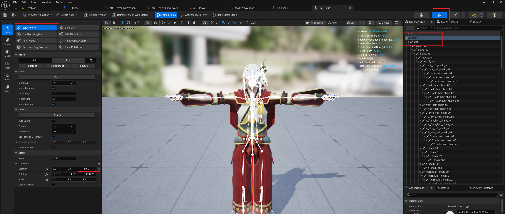


## 安装一些插件

electronic nodes啊 dark nodes啊   可以直接上淘宝买。不过有些插件没有最新版就是了

两种安装方式


```
以下两种安装方式二选一。

1）安装到虚幻引擎（推荐）
转到虚幻引擎安装位置的插件文件夹 Engine/Plugins
将解压得到的插件文件夹放入Marketplace文件夹下（如没有新建一个）。
启动虚幻引擎打开项目，菜单->编辑->插件里可查看到插件。

2）安装到项目
转到项目的根目录（[ProjectName].uproject文件所在的文件夹）
创建一个名为 Plugins的文件夹（如果没有），将解压得到的插件文件夹放入Plugins文件夹。
启动虚幻引擎打开项目，菜单->编辑->插件里可查看到插件。
```


# 正式开始完善项目 很多都是边学边做的，当然不是照抄，是明白原理然后在自己的项目中使用

# 构建运动系统，参考的lyra的运动系统实现

[2 - 01Create Blank project_哔哩哔哩_bilibili](https://www.bilibili.com/video/BV1kCsveoEgT?vd_source=39ee10d0477672d37574ff253a917df3&p=2&spm_id_from=333.788.player.switch)

这个教程主要是蓝图实现的，EMM在某些部分我会使用C++实现，或者说，都可以，哪个方便/性能好我就用哪个

## 开启插件

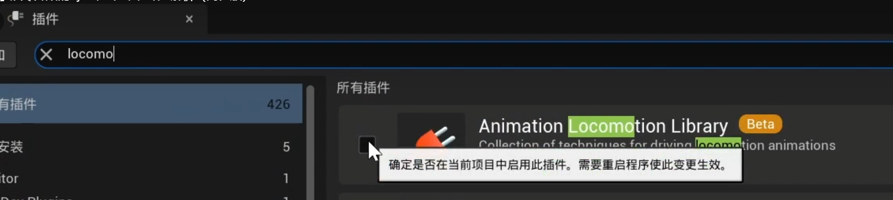

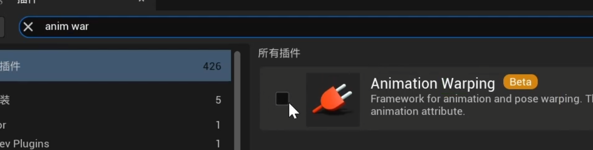

## 基础教学

### 使用蓝图接口为ABP添加接受max speed 和velocity的接口

额，虽然蓝图让其自动不需要转换。但是实际上在C++层面上来看，肯定是需要转换的。这里转换的损耗在哪里呢。我的理解中转换无非是直接将类的类型改了，好拿到对应的属性偏移和函数指针而已。大不了有一些检测是否有效的损耗。

然后我看了下说是UE中会根据uclass去检查是否继承，这部分开销比较大

```
每次运行时类型检查；
可能的继承链遍历；
UObject 类型元数据访问；
蓝图中的 Cast 节点还涉及 Blueprint VM 和反射调用，通常比 C++ Cast 更重；
大量对象、每帧多次调用时会累积。
```


AI是这么回答的。我选择用C++做

```
两者功能上没有本质的性能优势差异，蓝图 Cast 和接口消息都属于运行时检查。选择标准是：

只调用接口：直接 Message；
需要明确成功/失败流程或缓存引用：Cast To Interface；
需要访问具体类成员：才 Cast 到具体类。
另外，C++ 定义的接口和蓝图定义的接口，在蓝图中都可以 Cast 到接口；只要目标类实现了该接口，Cast 就会成功。
```

### 使用线程安全更新动画

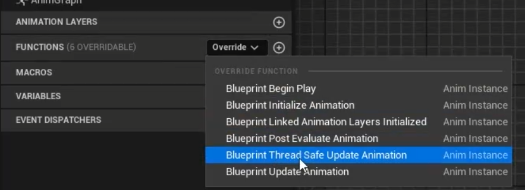

然后在函数内部可以使用property access来安全的获取可获得的属性，我猜是加了锁什么的

额 ，没看懂在蓝图里转换和在事件图标里转换有什么不同

AI如是说。我在begin里转换，然后缓存这个变量吧，没啥区别。我的更新会在线程安全函数里做

```
最终原则是：CharacterMovement 的读取放在游戏线程，动画线程只消费已经准备好的动画数据。
```


### 设置增强输入

他这里给一个IA绑定了多个输入，并且IA是ID的其如果是手柄应该可以返回一个浮点值，但是对于键盘只会返回1，然后为了区分返回值，他这里给其加了一个缩放的修改器

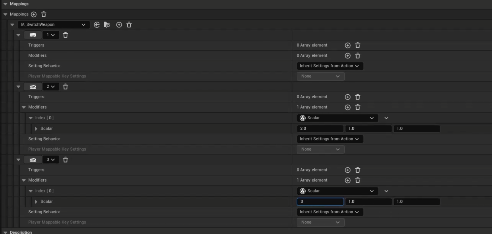

这个还挺好用的，一个IA就可以得到多种 之前没试过这种，都是一绑一个的

然后给character加了一个枚举变量。来得到角色的状态。角色的移动状态。我就放到character里。然后战斗的移动状态我放到combat组件里

好像不太行，如果在没有武器状态被眩晕了怎么算呢，不过好像也无所谓啊。都是先走角色，角色可以自己判断。可以，让战斗组件保持自己的独立性


AI建议是   感觉挺好的

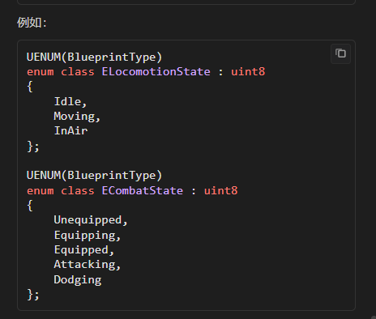


以及这里的状态，由于我之前是把动画蓝图的对象在beginPlay的时候存起来了。所以直接提升想要的数据为变量然后tick更新就好。但是确实好像使用接口的方式要性能好一点，毕竟少了赋值的节点，tick的时候只用读取就好。我要不还是改成接口实现吧。这样就变成了character依赖该ABP接口，依赖这块也要好点


### 基础状态机

这里有个知识点是状态机切换的规则是可以直接提升为变量的，比如说从都是切换到手枪，他可能是从其他状态切换过去的。那么正常来说你就需要写两次规则。但是提升规则为变量之后就只需要复用之前的规则就好


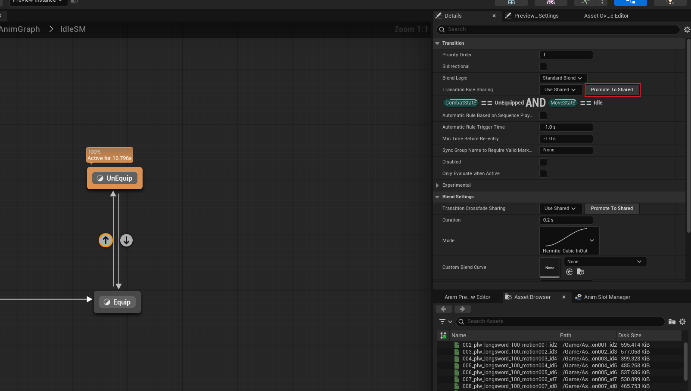

在做到之类遇到了播放动画时浮空的问题。详见游戏资源解包小结

### 使用sequence节点，为其设置函数

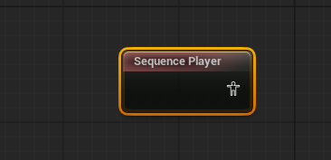

可以动态的配置其播放的序列  记得动画序列需要改为dynamic

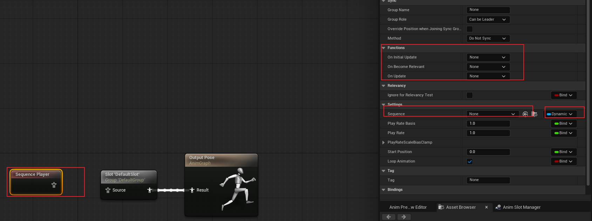

这里可以创建其对应的绑定函数

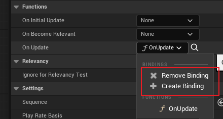

在函数里会有有一个蓝图节点的输入，可以给该输入设置sequence

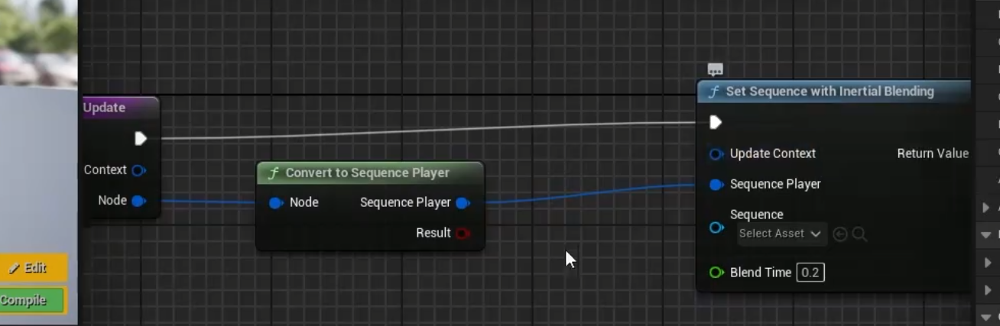

但是这个混合节点，你可以看到是惯性混合

所以在其输出后，在最终输出前加一个惯性节点

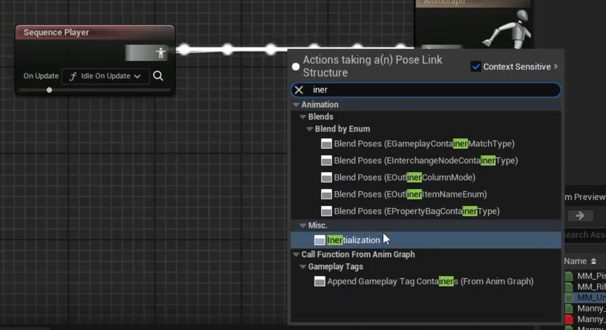

### 动画层 这个好像很重要

说其实就是动画的函数封装

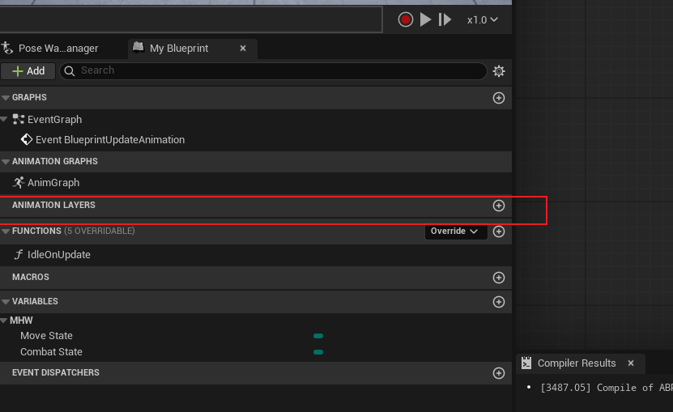

### 动画层接口

看起来功能也差不多，就是说让各个动画蓝图类说明自己实现了这个函数，一个可以输出pose的函数(动画层)

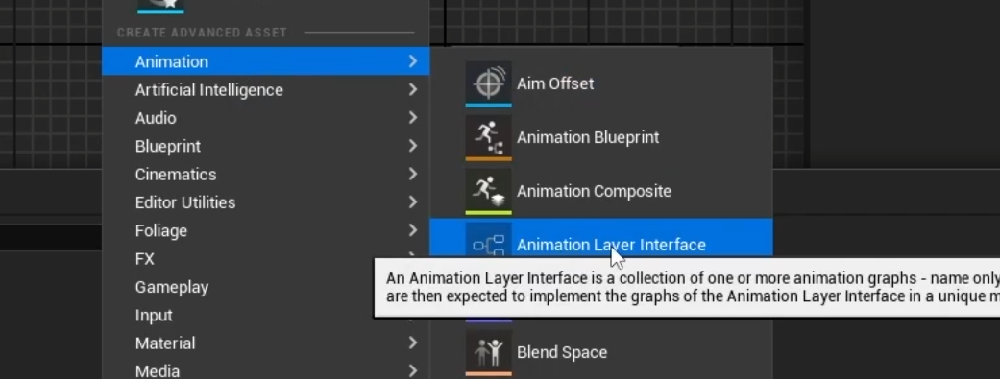

就和蓝图的接口函数库类似

然后实现了就可以在这里指定说自己实现了

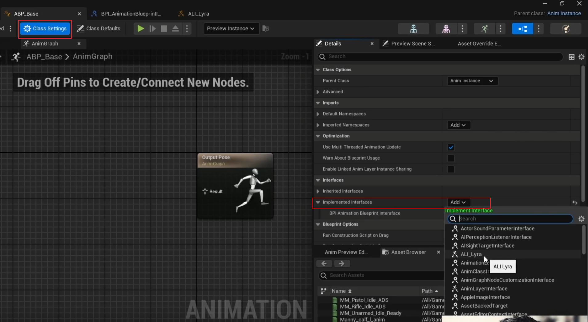


## 开始架构了。首先是在abp_base里完成了所有时机蓝图中需要的计算。

比如说他这里把计算idle姿势给放到了base的动画层接口里

作为接口实现层的ABP不会输出任何姿势数据，只是完成逻辑实现


### 在layer动画蓝图里实现想要的动画层 那么问题来了。怎么在其他主abp里使用他呢

在character 蓝图里 用linkAnimLayer蓝图节点   这个节点会把mesh上的 abp的layer实现用传入的替代

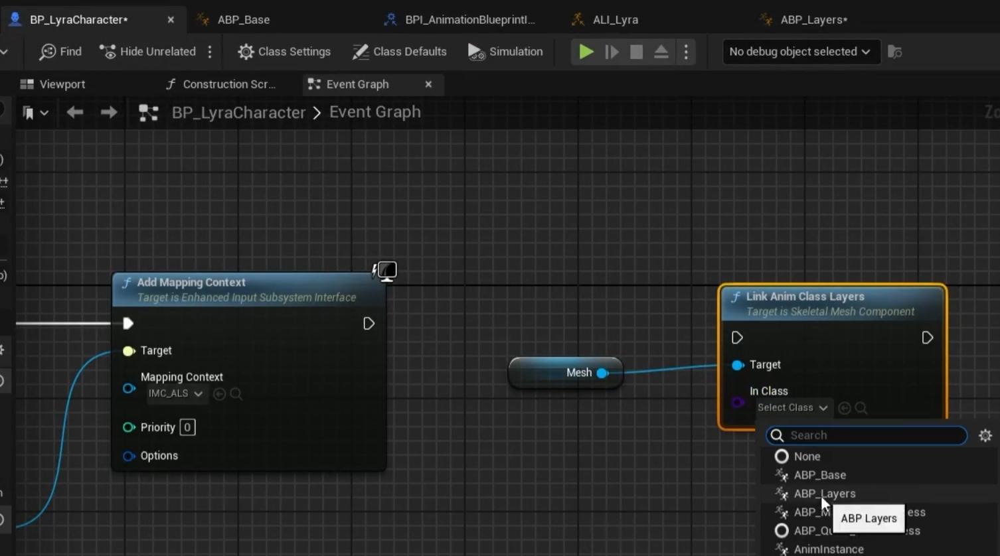 

layer层暴露出来的变量可以在其的类默认设置里看到

### 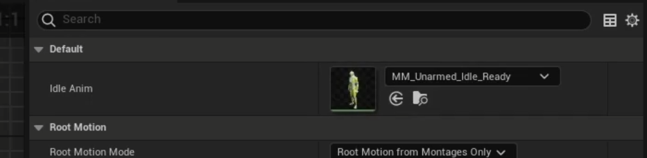

以及关键的是

这个链接的实现是可以随时切换的。意味着我可以在每一个layer里做完一整套状态的动作和姿态获取。然后在主ABP中重要状态切换，比如说切换了武器时换到对应的layer层实现。比如说链接到实现了持有手枪完整状态的一个layer

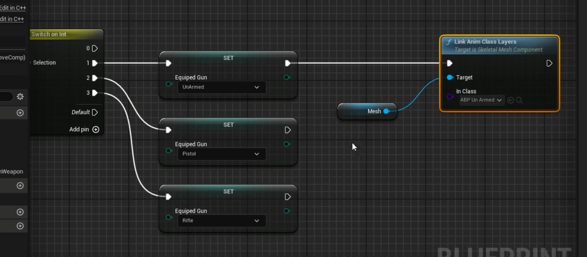

对于我们的项目。在持有武器状态。我们是需要有不同的动画的。虽然在连招时是播放蒙太奇，但是这个思想可以在idle和移动时简化很多操作。对于拓展而言，只需要获取到所持武器的enum然后切换到单独实现的layer就好了


在做的时候我还发现。这个样子还不用依赖于ABP了，只管给他设置对应的layers就好，也不管他的参数，状态切换都在character做了

但是这样切换有些生硬啊。所以之类就需要用到惯性了。然后要添加惯性就要参考之前的在sequence的绑定update函数里调用setSequenceWithxx  这里还是暴露了属性的，不过是在内部设置了。但是这样不会性能很差吗。本来只需要设置一次的。现在每帧都要设置


以及TODO:这一部分是不是可以在C++里写。然后通过DA的方式配置  感觉可行。只要他这个蓝图库能在C++里调用

### 一些调整蓝图的连线的快捷键

Q:快速整理，把线条尽量变为直线

其实就是右键对其里面

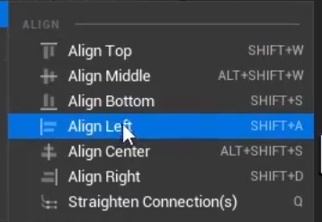


按C可以添加注释和修改颜色 


## 添加增强输入移动角色

我这里直接就使用手柄输入了

这里顺便提一嘴。之前一直没搞明白axies和axes的区别   原来后者是前者的复数形式，乐。其意义就是去获取三条轴线 

其实这里只要用标签来标识输入甚至可以做到手柄和键鼠一边按一边用。在locomotion做完之后我会改造

他这里获取的时候传了roll。我是没有传的。不知道这里后续有什么用

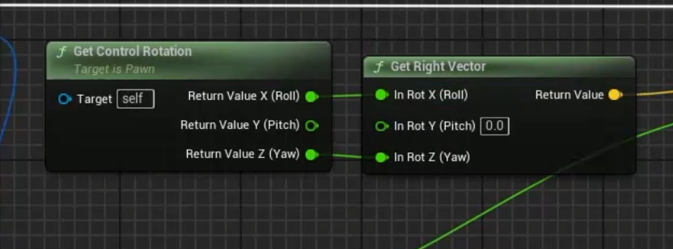

### 制作移动动画

他这里教程的素材是，四向走路和四向奔跑。让我找下我的

怪猎是只有一个循环的跑步动画。然后有很多起始动画。并没有专门的四向移动。甚至持刀状态没有跑步和走路区分。不过应该不影响把


这里要实时获取数据那就没办法了，只有让蓝图拿到charater 然后我们在线程安全里折叠的函数需要勾选上线程安全，不然会报错的

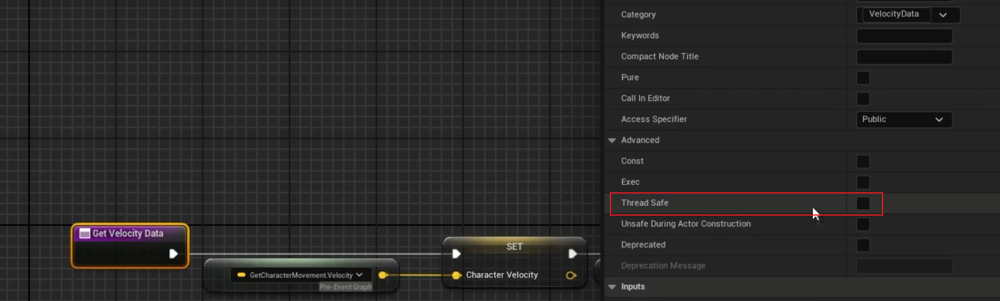


这里在判断停止时，别直接判0。那玩意是浮点的

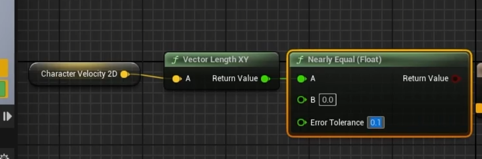


然后对于有根运动的和动画   如果不勾选根运动。那么他就会在运动完之后回到原点。但是我们想让其保持在原地做的话，就要勾选根运动和锁定

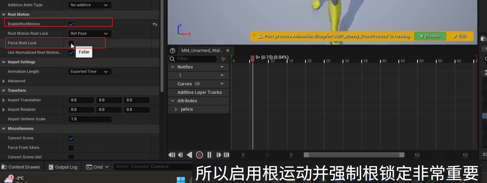


这里又遇到了资产问题。不过这次解决的很快。详见游戏资源解包一章

### 教程这里在做瞄准系统...我们也可以做。有翔虫的瞄准，瞄准时也不应该跑

在切换到不同的状态时，如瞄准，移动，跑步。他希望有不同的移动速度，加速度，摩擦系数等等

他自定义了结构体然后每个状态会有自己的移动参数。这一块就可以拿DA来存。直接放在character上就行吧


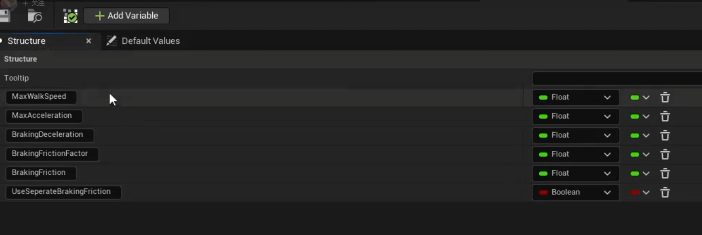

其实就是这边的一些参数

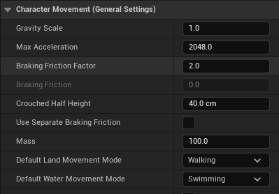

他的初始值是这么填的。抄一下。到时候再仔细调一下

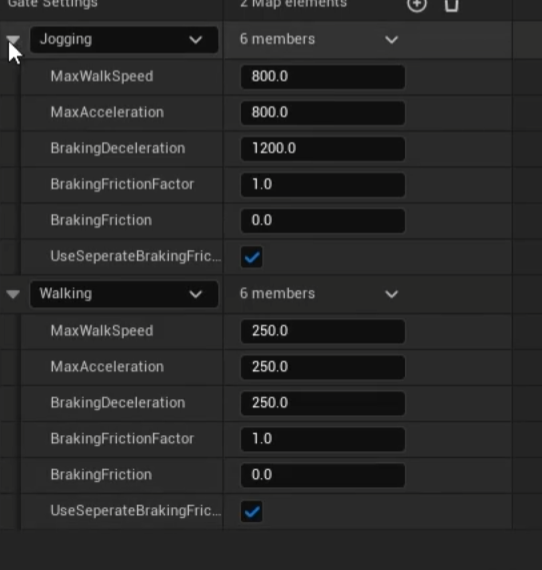

### 将状态的动画进动画层接口

那么问题来了。layer层可以执行动画，但是其没法获取到MoveState


因为之前在绑定动画层的时候实际上就把playerABP和layer绑定起来了。layer可以直接获取ownComponent 来获取角色网格
由此来获取到polayer的instance来获取到state

以及这里为什么使用propertyAccess和普通的直接get有什么区别


```
普通变量读取：适合简单、常规蓝图逻辑。
Property Access：适合跨对象、嵌套属性，以及动画蓝图中的高效、线程安全访问。
它不是“读取结果不同”，主要区别在于访问路径、编译优化和线程安全能力。
```

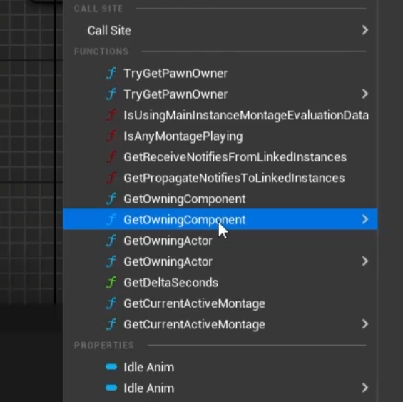

记得这个蓝图函数返回值一定需要是 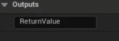  并且是纯函数，我自己设成了线程安全

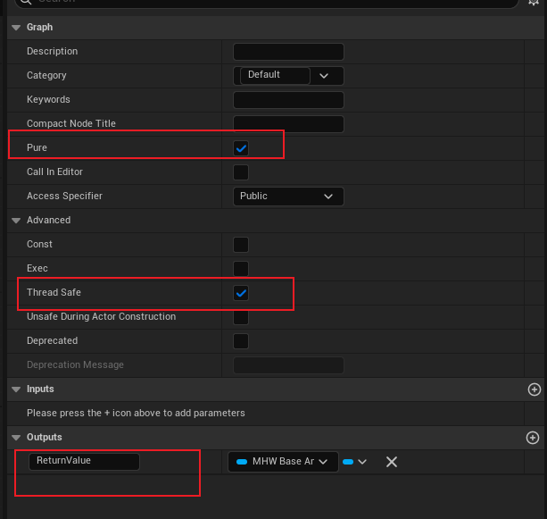


不然没法再属性获取里调用这个函数。这个设置固定返回值其实就是为了可以在propertyAccess里直接嵌套函数获取值

### 将circle的实现拓展到不同的武器状态

使用sequence player来设置序列，并且设置设置惯性

同时暴露出两个序列变量

步骤：

1.设置sequence player 包括  loop   dynamicSequence  bindUpdateFunc

2.在函数内部转换输入node为seqence player  。并且调用setSequenceWithInertial函数

3.将需要select的序列提升为参数，让子类都可以设置


总结为就是，不同的武器使用不同的动画层，一种武器的不同状态在动态层内部自行修改


### 批量修改资产属性，比如说批量开启根运动

选中需要修改的资产

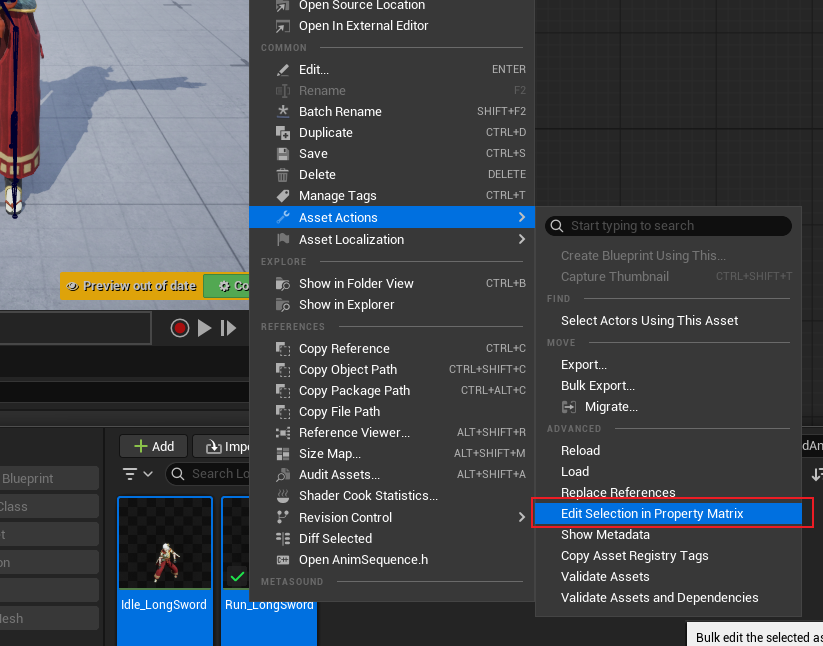

右边的详情面板就可以修改所有的内容

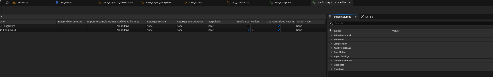

## 调试方法

额就是直接在update里打印state啊。这是否。。

记得配置对应的key来配置显示通道就好

当然也可以这样来抽象为一个个的功能函数这样更好 

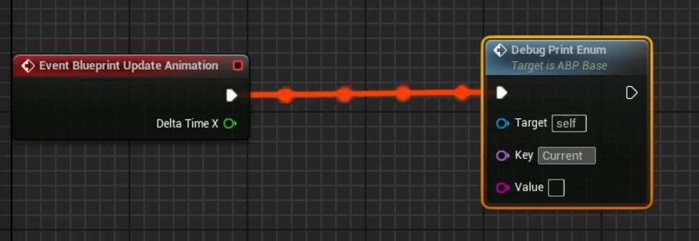

当然也要绘制加速度方向和移动方向之类的

这里当然自己抽象就好。


### 慢动作模式，这个还挺有用的

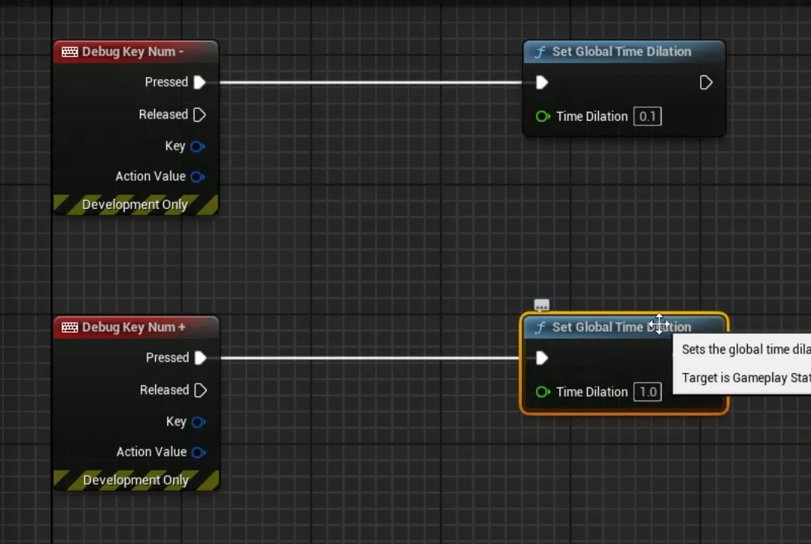

## 判断前后左右移动

需要获取角色的旋转数据，和获取actor以及Velocity是一样的


我其实更想知道， 他这里获取方向float是什么意思

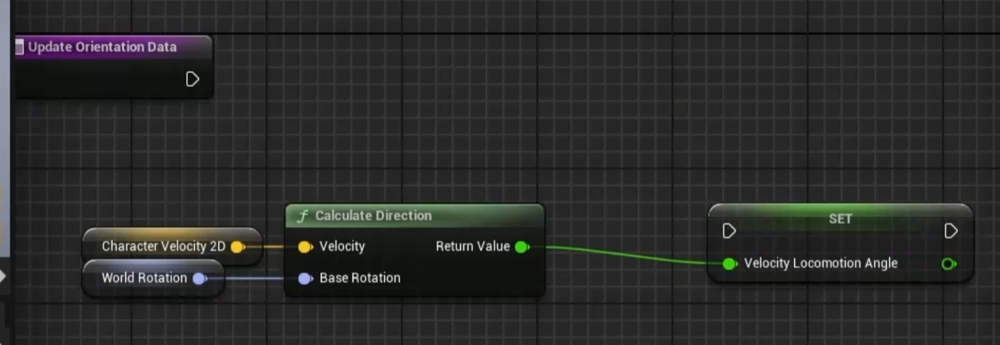

可以看到是计算移动方向和旋转方向的角度差值

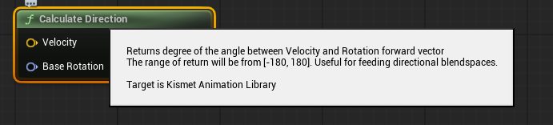

其计算公式为。旋转的方向减去移动速度的方向。逆时针角度正向增大，顺时针角度逆向增大。以旋转角度为0

即以旋转方向为正前方。加速度在左侧即角度为0-180 那么  值为0 -   (0到180) 为负值右侧同理


### 现在知道了角度偏差。那么如何判断其应该用哪一个角度动画呢

说是使用的enum来定义。但是这是对于PC键盘来说。。。那么对于手柄呢

然后在主动画蓝图里留一个方向属性


然后在线程安全函数中每一帧计算自己目前应该处于的移动枚举。但是这样的话不就只有转向的一小段时间会是转向方向吗，其他时候都应该是向前

我觉得的这个也挺合理的。就只有转向的一小会播放是转向动画。转向完了就是唯一的直走动画。 但是这样就需要转向动画时长和转向完成的实际时长相匹配才可以


计算范围可以直接用这个 .当然因为向后不是一个连续区间。不能用这个，只能一个个判断

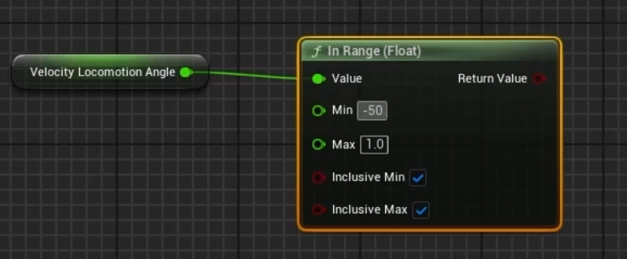

当然他把这里参数化了。以便在其他的地方也可以根绝传入的角度来计算出对应的方向枚举 然后直接返回一个枚举。就是工具化了

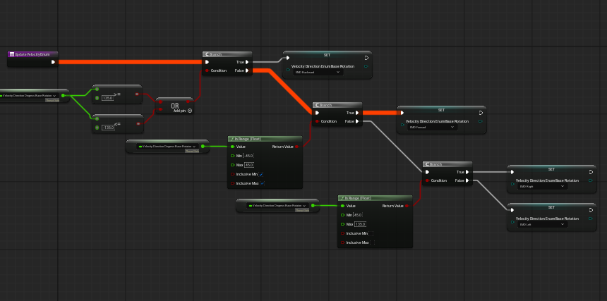


### 判断与上一帧的角度差

他这里的意思其实是。前提是我们还没有吧角色的实际旋转和移动方向同步

这个前提下如果角色在45度反复变换。那么姿势就会在前和右反复切换

这个怎么办呢。其解决方法就是在当前所处的方向枚举下扩大角度判定。比如说本来前进时+- 45 但是当我在前进时，修改为+-45 +N

这样就算其变回到触发前进的那个角度也不会变为向左或者向右。

这个N变量教程称为deadZone


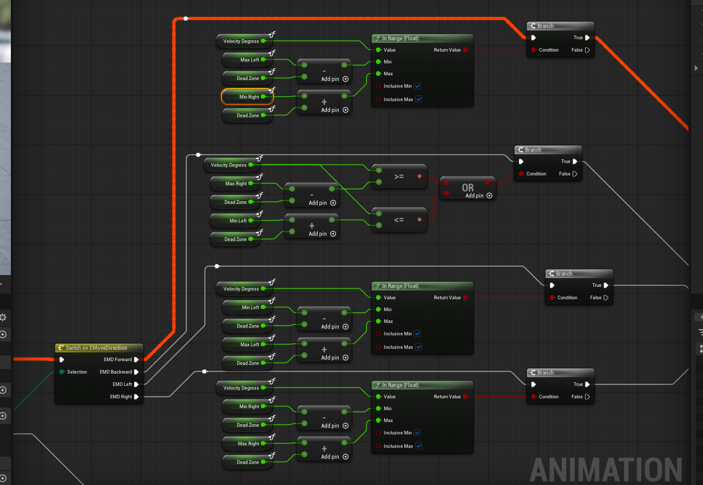


### 根据状态选择动画。只不过现在的动画是会一直保持在对应的切换状态

(我是觉得，这个enum应该是切换状态。然后在对应的切换状态中播放切换动画。然后回到正常的直走动画)

在layer的cycle里就需要做两重switch，一个是选择是否在奔跑，一个选择前后左右


怪猎不是用的专门的四向移动动画他只有一个切换动画.应该就是会每次切换方向完成后变回最初的移动动画

这里就跟不下去了。没有对应的素材。不过我觉得很快就可以继续了。比如说他开始做过度的时候

这部分他是创建的结构体在每一个layer里存放对应的动画资产。当然对于我们来说，要放到dataAsset里 肯定是要使用gameplayTag来链接资产和输入的


主要是学习思想，实现都要根据项目具体需求去做的


### 修复角色开始运动是由于摩擦力导致的滑动

使用插件修复  

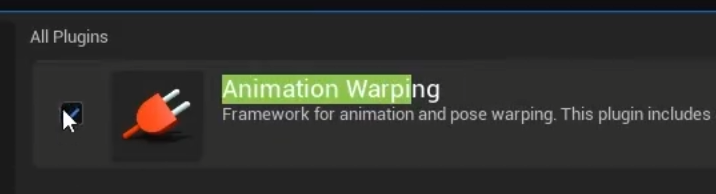


```
什么是 Stride Warping？
Stride Warping 是虚幻引擎中 Pose Warping（姿势扭曲） 系统的三个节点之一，它是一个动画蓝图节点，用于动态调整角色的步幅长度，使其与胶囊体（Capsule）的实际移动速度相匹配。 [1]

核心作用
通过定义运动速度和相关骨骼，Stride Warping 节点能够修改脚部位置之间的间距，从而动态调整步幅长度以匹配移动速度


Pose Warping
├── Orientation Warping  → 修正运动方向（脚部IK骨骼对齐移动方向）
├── Stride Warping       → 动态调整步幅长度以匹配移动速度  ← 本节点
└── Slope Warping        → 根据地面坡度调整脚部姿势
```


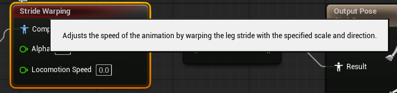

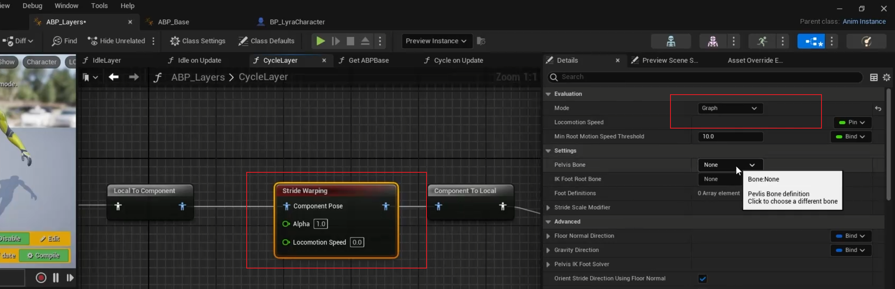

以及这里指明了，如果需要能够正确配置als角色需要有这些ik骨骼  我们好像。。没有啊。不过我猜肯定是可以自己添加的

我试了试自己添加ikroot效果是可以。可以正确的调整步幅 就是他这里的骨骼命名太抽象了

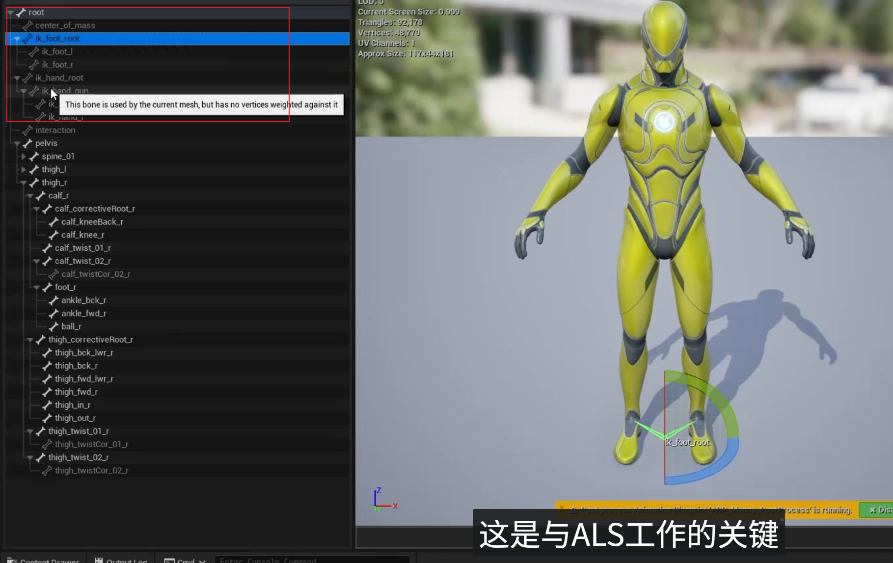

需要指定根骨和对应的ik腿骨，以及实际的大腿骨

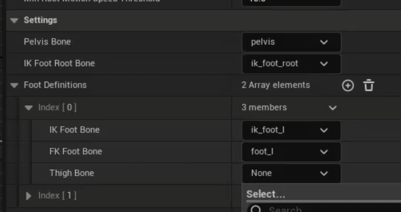

# 我在自己构思部分实现逻辑的时候。发现很多的内容。我都没法自己从0架构。太庞大了。有点无从下手的感觉。

[Udemy 虚幻UE5 C++ 为基础的高级第三人称 RPG 教程 - 第二部分_哔哩哔哩_bilibili](https://www.bilibili.com/video/BV1Q4CCYxEj1/?spm_id_from=333.1387.homepage.video_card.click&vd_source=39ee10d0477672d37574ff253a917df3)

接下来我会跟着这个教程，一点点搭建。 在同文件夹的其他note里


